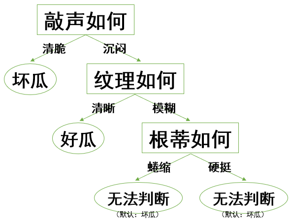

# Report: Lab2 决策树

刘滨瑞 未央-水木12 2021012579

## Ⅰ 小练习回答

首先，我们将数据转化为数字格式。

方便起见，我们和题目中一样，约定:

- “属性1”为“根蒂”，“蜷缩”为$0$，“硬挺”为$1$；
- “属性2”为“敲声”，“清脆”为$0$，“沉闷”为$1$；
- “属性3”为“纹理”，“清晰”为$0$，“模糊”为$1$；
- “标签”为“是否为好瓜”，“是好瓜”为$1$，“是坏瓜”为$2$。

| 编号 | 属性1 | 属性2 | 属性3 | 标签 |
| :-: | :-: | :-: | :-: | :-: |
| 1 | 0 | 1 | 0 | 1 |
| 2 | 1 | 0 | 0 | 2 |
| 3 | 0 | 1 | 1 | 2 |
| 4 | 1 | 0 | 1 | 2 |
| 5 | 0 | 0 | 0 | 2 |
| 6 | 0 | 1 | 1 | 1 |

### ID3算法

#### 第一次分类

首先，计算根据各属性分类的信息增益，找出最大值。

$Ent_{total}=-(\frac{1}{3}\times\log_2\frac{1}{3}+\frac{2}{3}\times\log_2\frac{2}{3})=0.9183$

- 根据**属性1**分类

| 编号 | ==属性1== | 属性2 | 属性3 | 标签 |
| :-: | :-: | :-: | :-: | :-: |
| 1 | 0 | 1 | 0 | 1 |
| 3 | 0 | 1 | 1 | 2 |
| 5 | 0 | 0 | 0 | 2 |
| 6 | 0 | 1 | 1 | 1 |
$Ent=-(0.5\times\log_20.5+0.5\times\log_20.5)=1$

| 编号 | ==属性1== | 属性2 | 属性3 | 标签 |
| :-: | :-: | :-: | :-: | :-: |
| 2 | 1 | 0 | 0 | 2 |
| 4 | 1 | 0 | 1 | 2 |
$Ent=-(1\times \log_2 1)=0$

故$IG_1=0.9183-\frac{2}{3}\times1-\frac{1}{3}\times0 =0.2516$

- 根据**属性2**分类

| 编号 | 属性1 | ==属性2== | 属性3 | 标签 |
| :-: | :-: | :-: | :-: | :-: |
| 2 | 1 | 0 | 0 | 2 |
| 4 | 1 | 0 | 1 | 2 |
| 5 | 0 | 0 | 0 | 2 |
$Ent=-(1\times\log_21)=0$

| 编号 | 属性1 | ==属性2== | 属性3 | 标签 |
| :-: | :-: | :-: | :-: | :-: |
| 1 | 0 | 1 | 0 | 1 |
| 3 | 0 | 1 | 1 | 2 |
| 6 | 0 | 1 | 1 | 1 |
$Ent=-(\frac{1}{3}\times\log_2\frac{1}{3}+\frac{2}{3}\times\log_2\frac{2}{3})=0.9183$

故$IG_2=0.9183-0.5\times0-0.5\times0.9183=0.4591$

- 根据**属性3**分类

| 编号 | 属性1 | 属性2 | ==属性3== | 标签 |
| :-: | :-: | :-: | :-: | :-: |
| 1 | 0 | 1 | 0 | 1 |
| 2 | 1 | 0 | 0 | 2 |
| 5 | 0 | 0 | 0 | 2 |
$Ent=-(\frac{1}{3}\times\log_2\frac{1}{3}+\frac{2}{3}\times\log_2\frac{2}{3})=0.9183$

| 编号 | 属性1 | 属性2 | ==属性3== | 标签 |
| :-: | :-: | :-: | :-: | :-: |
| 3 | 0 | 1 | 1 | 2 |
| 4 | 1 | 0 | 1 | 2 |
| 6 | 0 | 1 | 1 | 1 |
$Ent=-(\frac{1}{3}\times\log_2\frac{1}{3}+\frac{2}{3}\times\log_2\frac{2}{3})=0.9183$

故$IG_3=0.9183-0.5\times0.9183-0.5\times0.9183=0$

**IG_2最大，故应以属性2作第一次分类！**

分类结果为：

- A子集

| 编号 | 属性1 | 属性2 | 属性3 | 标签 |
| :-: | :-: | :-: | :-: | :-: |
| 2 | 1 | 0 | 0 | 2 |
| 4 | 1 | 0 | 1 | 2 |
| 5 | 0 | 0 | 0 | 2 |

- B子集

| 编号 | 属性1 | 属性2 | 属性3 | 标签 |
| :-: | :-: | :-: | :-: | :-: |
| 1 | 0 | 1 | 0 | 1 |
| 3 | 0 | 1 | 1 | 2 |
| 6 | 0 | 1 | 1 | 1 |

#### 第二次分类

对于A子集，标签均一致，不必再继续分类。

对于B子集继续分类，重复上述过程。注意属性2已被用于分类，故后续分类中均不再采用。

$Ent_{total}=-(\frac{1}{3}\times\log_2\frac{1}{3}+\frac{2}{3}\times\log_2\frac{2}{3})=0.9183$

- 根据**属性1**分类

| 编号 | ==属性1== | 属性2 | 属性3 | 标签 |
| :-: | :-: | :-: | :-: | :-: |
| 1 | 0 | 1 | 0 | 1 |
| 3 | 0 | 1 | 1 | 2 |
| 6 | 0 | 1 | 1 | 1 |
$Ent=-(\frac{1}{3}\times\log_2\frac{1}{3}+\frac{2}{3}\times\log_2\frac{2}{3})=0.9183$

| 编号 | ==属性1== | 属性2 | 属性3 | 标签 |
| :-: | :-: | :-: | :-: | :-: |
$Ent=0$

故$IG_1=0.9183-1\times0.9183=0$

- 根据**属性3**分类

| 编号 | 属性1 | 属性2 | ==属性3== | 标签 |
| :-: | :-: | :-: | :-: | :-: |
| 1 | 0 | 1 | 0 | 1 |
$Ent=0$

| 编号 | 属性1 | 属性2 | ==属性3== | 标签 |
| :-: | :-: | :-: | :-: | :-: |
| 3 | 0 | 1 | 1 | 2 |
| 6 | 0 | 1 | 1 | 1 |
$Ent=-(0.5\times\log_20.5+0.5\times\log_20.5)=1$

故$IG_3=0.9183-\frac{1}{3}\times0-\frac{2}{3}\times1=0.2516$

**IG_3最大，故应以属性3作第二次分类！**

分类结果为：

- C子集

| 编号 | 属性1 | 属性2 | ==属性3== | 标签 |
| :-: | :-: | :-: | :-: | :-: |
| 1 | 0 | 1 | 0 | 1 |

- D子集

| 编号 | 属性1 | 属性2 | ==属性3== | 标签 |
| :-: | :-: | :-: | :-: | :-: |
| 3 | 0 | 1 | 1 | 2 |
| 6 | 0 | 1 | 1 | 1 |

#### 第三次分类

对于C子集，标签均一致，不必再继续分类。

对于D子集，仅能用属性1分类。

分类结果为：

- E子集

| 编号 | 属性1 | 属性2 | 属性3 | 标签 |
| :-: | :-: | :-: | :-: | :-: |
| 3 | 0 | 1 | 1 | 2 |
| 6 | 0 | 1 | 1 | 1 |

- F子集

| 编号 | 属性1 | 属性2 | 属性3 | 标签 |
| :-: | :-: | :-: | :-: | :-: |

所有属性均已用于分类，停止。其中E子集中，两种判断结果相等而无法判断；F子集为空，无法判断。将任意返回一个决策结果。
（在实际实现上，默认判断为最后一类。）

#### 决策树最终形态



### CART算法

#### 第一次分类

首先，计算根据各属性分类的基尼系数，找出最大值。

- 根据**属性1**分类

| 编号 | ==属性1== | 属性2 | 属性3 | 标签 |
| :-: | :-: | :-: | :-: | :-: |
| 1 | 0 | 1 | 0 | 1 |
| 3 | 0 | 1 | 1 | 2 |
| 5 | 0 | 0 | 0 | 2 |
| 6 | 0 | 1 | 1 | 1 |
$G=1-(0.5^2+0.5^2)=0.5$

| 编号 | ==属性1== | 属性2 | 属性3 | 标签 |
| :-: | :-: | :-: | :-: | :-: |
| 2 | 1 | 0 | 0 | 2 |
| 4 | 1 | 0 | 1 | 2 |
$G=1-(1^2)=0$

故$Gini_1=\frac{2}{3}\times0.5+\frac{1}{3}\times0=0.3333$

- 根据**属性2**分类

| 编号 | 属性1 | ==属性2== | 属性3 | 标签 |
| :-: | :-: | :-: | :-: | :-: |
| 2 | 1 | 0 | 0 | 2 |
| 4 | 1 | 0 | 1 | 2 |
| 5 | 0 | 0 | 0 | 2 |
$G=1-(1^2)=0$

| 编号 | 属性1 | ==属性2== | 属性3 | 标签 |
| :-: | :-: | :-: | :-: | :-: |
| 1 | 0 | 1 | 0 | 1 |
| 3 | 0 | 1 | 1 | 2 |
| 6 | 0 | 1 | 1 | 1 |
$G=1-((\frac{1}{3})^2+(\frac{2}{3})^2)=0.4444$

故$Gini_2=0.5\times0+0.5\times0.4444=0.2222$

- 根据**属性3**分类

| 编号 | 属性1 | 属性2 | ==属性3== | 标签 |
| :-: | :-: | :-: | :-: | :-: |
| 1 | 0 | 1 | 0 | 1 |
| 2 | 1 | 0 | 0 | 2 |
| 5 | 0 | 0 | 0 | 2 |
$G=1-((\frac{1}{3})^2+(\frac{2}{3})^2)=0.4444$

| 编号 | 属性1 | 属性2 | ==属性3== | 标签 |
| :-: | :-: | :-: | :-: | :-: |
| 3 | 0 | 1 | 1 | 2 |
| 4 | 1 | 0 | 1 | 2 |
| 6 | 0 | 1 | 1 | 1 |
$G=1-((\frac{1}{3})^2+(\frac{2}{3})^2)=0.4444$

故$Gini_3=0.5\times0.4444+0.5\times0.4444=0.4444$

**Gini_2最小，故应以属性2作第一次分类！**

分类结果为：

- A子集

| 编号 | 属性1 | 属性2 | 属性3 | 标签 |
| :-: | :-: | :-: | :-: | :-: |
| 2 | 1 | 0 | 0 | 2 |
| 4 | 1 | 0 | 1 | 2 |
| 5 | 0 | 0 | 0 | 2 |

- B子集

| 编号 | 属性1 | 属性2 | 属性3 | 标签 |
| :-: | :-: | :-: | :-: | :-: |
| 1 | 0 | 1 | 0 | 1 |
| 3 | 0 | 1 | 1 | 2 |
| 6 | 0 | 1 | 1 | 1 |

#### 第二次分类

对于A子集，标签均一致，不必再继续分类。

对于B子集继续分类，重复上述过程。注意属性2已被用于分类，故后续分类中均不再采用。

- 根据**属性1**分类

| 编号 | ==属性1== | 属性2 | 属性3 | 标签 |
| :-: | :-: | :-: | :-: | :-: |
| 1 | 0 | 1 | 0 | 1 |
| 3 | 0 | 1 | 1 | 2 |
| 6 | 0 | 1 | 1 | 1 |
$G=1-((\frac{1}{3})^2+(\frac{2}{3})^2)=0.4444$

| 编号 | ==属性1== | 属性2 | 属性3 | 标签 |
| :-: | :-: | :-: | :-: | :-: |
$G=0$

故$Gini_1=1\times0.4444=0.4444$

- 根据**属性3**分类

| 编号 | 属性1 | 属性2 | ==属性3== | 标签 |
| :-: | :-: | :-: | :-: | :-: |
| 1 | 0 | 1 | 0 | 1 |
$G=1-(1^2)=0$

| 编号 | 属性1 | 属性2 | ==属性3== | 标签 |
| :-: | :-: | :-: | :-: | :-: |
| 3 | 0 | 1 | 1 | 2 |
| 6 | 0 | 1 | 1 | 1 |
$G=1-(0.5^2+0.5^2)=0.5$

故$Gini_3=\frac{1}{3}\times0+\frac{2}{3}\times0.5=0.3333$

**Gini_3最小，故应以属性3作第二次分类！**

分类结果为：

- C子集

| 编号 | 属性1 | 属性2 | ==属性3== | 标签 |
| :-: | :-: | :-: | :-: | :-: |
| 1 | 0 | 1 | 0 | 1 |

- D子集

| 编号 | 属性1 | 属性2 | ==属性3== | 标签 |
| :-: | :-: | :-: | :-: | :-: |
| 3 | 0 | 1 | 1 | 2 |
| 6 | 0 | 1 | 1 | 1 |

#### 第三次分类

对于C子集，标签均一致，不必再继续分类。

对于D子集，仅能用属性1分类。

分类结果为：

- E子集

| 编号 | 属性1 | 属性2 | 属性3 | 标签 |
| :-: | :-: | :-: | :-: | :-: |
| 3 | 0 | 1 | 1 | 2 |
| 6 | 0 | 1 | 1 | 1 |

- F子集

| 编号 | 属性1 | 属性2 | 属性3 | 标签 |
| :-: | :-: | :-: | :-: | :-: |

E、F子集中标签均一致，不必再继续分类。其中F子集为空而无法判断，将任意返回一个决策结果。

#### 决策树最终形态


## Ⅱ ```decisionTree.cpp```思路简述

### ```example```类

用于储存实例信息，包括维度，数据和标签值。

从训练文件与测试文件中读入数据后，首先将数据存入```example```类中，并使用```init()```方法进行初始化。

### ```node```类

为决策树的节点类，储存有多个实例，有如下变量和方法：

#### 变量

- ```attributes```：仍可用于分类的属性集合
- ```attribute```：本节点用于分类的属性
- ```dimension```：储存数据的维度
- ```num```：储存的实例数量
- ```examples```：数据区，为指向```example```的指针数组
- ```areas```：数据值域
- ```lc```、```rc```：左右子节点

#### 方法

- ```void append(example* new_example)```
添加一条实例数据。

- ```double cal_IG_ID3(int attri)```
按某个属性，将节点中的实例分为两类，按ID3算法计算其信息增益（IG）。

- ```double cal_IG_CART(int attri)```
按某个属性，将节点中的实例分为两类，按CART算法计算其信息增益。
我们定义CART算法中的信息增益（IG）为$1$减去基尼系数，如此我们可统一以IG最大为分类属性的选取标准。

- ```int check()```
检查本节点是否应停止决策，返回决策结果。

- ```int decide(const example& x)```
在决策树建立后调用。输入实例，输出决策结果。

- ```void build_ID3()```
根据ID3算法，建立决策树。
首先遍历每一个```attributes```中的属性，调用```cal_IG_ID3()```方法，选取信息增益最大的属性。
然后依据该属性，将本节点中储存的实例分为两类，并据此创建左子节点和右子节点。子节点复制本节点的可用属性集```attributes```，我们删去其中刚刚用于分类的属性。
对左右子节点调用```check()```。若结束，返回决策结果；否则对子节点递归调用```build_ID3()```。

- ```void build_CART()```
和```build_ID3()```完全一致，仅计算信息增益时调用```cal_IG_CART()```方法，而非```cal_IG_ID3()```方法。

## Ⅲ 两种决策树在测试集上的表现

统计两种算法的决策树生成用时与在```data_test_in```中的判断正确率，可以反映算法的准确率与效率。

| 决策树 | 准确率 | 平均构建耗时 |
| :-: | :-: | :-: |
| ID3决策树 | $76.50\%$ | $26.3ms$ |
| CART决策树 | $76.75\%$ | $26.0ms$ |

可见，两种算法在**准确率**和**效率**上**没有明显差距**。

## Ⅳ 思考题回答

### 1

我们仍然采用本程序中的算法，只是对于多离散值的属性，我们将作多次判断。

举例而言，设A属性的可取值为：${1,2,3}$，在判断信息最大的属性时，我们将遍历“A为1/A不为1”，“A为2/A不为2”，“A为3/A不为3”三种分类情况，分别计算信息增益的值。

若判断“A为1/A不为1”为信息增益最大的分类情况，在区分左右子树时我们作如下操作：对于分类为“A为1”的左子树，我们在其属性集中删除A属性；对于分类为“A不为1”的右子树，我们在其属性集内将A属性的可取值删去“1”。

### 2

对于连续值的属性，我们希望将其转化为多离散值的属性，即可使用使用刚刚讨论的方法加以处理。

对于A属性，设训练集中A属性的值在去重后可升序排列为$A_v=\{a_1,a_2,...,a_n\}$。我们取值$B_v=\{b_1,b_2,...,b_{n-1}\}$，其中$b_m=(a_m+a_{m+1})/2$。

我们使用$B_v$对A属性分类，将是否属于区间$(-\infty,b_1],(b_1,b_2],...,(b_{n-1},\infty)$作为分类的依据即可。这等价于$n-1$多离散值属性的情况。

### 3

- 多叉决策树相较于二叉决策树：

#### 优势

1. 多叉决策树的结构更为简单。多叉决策树的深度至多和属性数量相等，而二叉决策树的深度可能会达到所有属性的可能取值的数量。这导致多叉决策树在效率上更优，尤其是在某些属性的取值很多时。
2. 多叉决策树具有更好的可解释性。决策树生成后，在多叉决策树中可以更明显地看出决策都逻辑过程、各属性对结果的重要程度与属性的倾向性。

#### 劣势

1. 多叉决策树更容易发生过拟合。如果某一个属性取某个值的样本很少，那么我们本不应该考虑这样的情况。但是在多叉决策树中，这种情况有更大可能被纳入决策依据，从而导致模型的泛化性降低。
2. 在数据结构的实现上，多叉决策树更为复杂。因为二叉决策树可以仅用左右子树表达连接关系，而多叉决策树则需要考虑子树的数量。

### 4

#### 二值属性例子

| 性别 | 生活地域 | label:对粽子馅的偏好 |
| :-: | :-: | :-: |
| 男/女 | 南方/北方 | 甜/咸 |

#### 多离散值属性例子

| 本科年级 | 院系 | label:对阳光长跑的态度 |
| :-: | :-: | :-: |
| 大一~大四 | {各院系} | 支持/不支持 |

#### 连续值属性例子

| 温度 | 风强 | label:一小时后是否会下雨 |
| :-: | :-: | :-: | :-: |
| (连续值) | (连续值) | 是/否 |

## Ⅴ 完成时间估计

### 7小时

其中编写源代码约3小时，debug约2小时，完成report约2小时。
