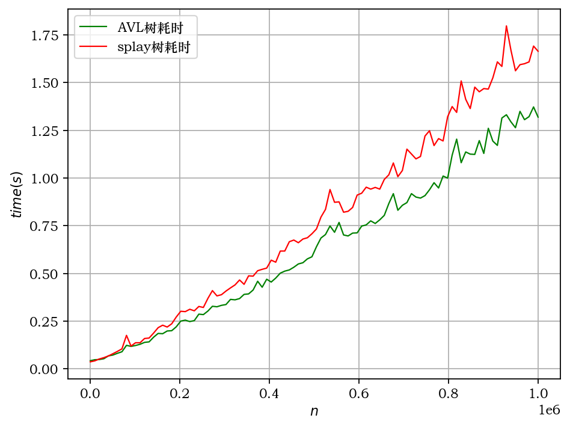
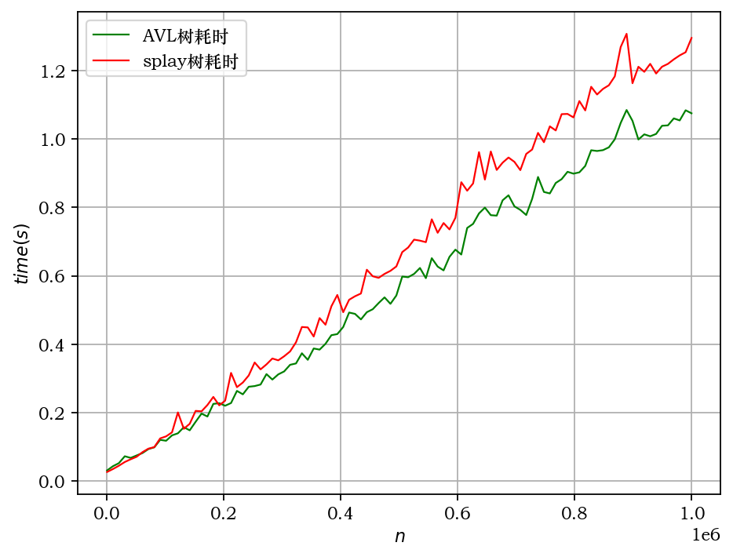
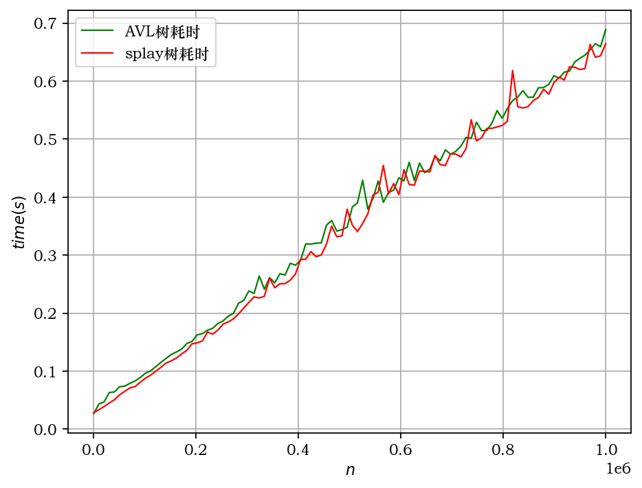
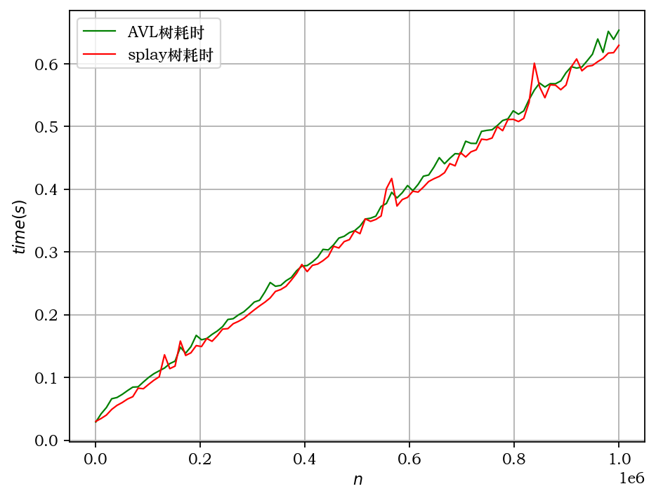

# Report: Lab3 BBST

刘滨瑞 未央-水木12 2021012579

## Ⅰ 提交说明

提交的压缩包的目录结构如下。

```c
lab3BBST_刘滨瑞2021012579.zip
│ report.md
│
└───pics
│
└───checkit
│ │ generator.py
│ │ monitor.ipynb
│ │
│ └───input
│ └───test_AVL
│ └───test_splay
│
└───src
  │ AVL.cpp
  │ splay.cpp
```

- `report.md`是实验报告。
- `pics`文件夹内是效率统计的图表。
- `checkit`文件夹内是测试用脚本文件。
`checkit/generator.py`是**测例生成器**，能够按特定规则生成测例文件，储存在`checkit/input`中。
`checkit/monitor.ipynb`是测试器，负责对比**AVL树**和**splay树**在生成测例下的输出结果，并以图表的形式给出两种树的效率统计。
`checkit/test_AVL`和`checkit/test_splay`文件夹内是编译文件和程序的输出结果。
- `src`文件夹内是实验的源代码。
`src/AVL.cpp`是实现**AVL树**的源代码。
`src/splay.cpp`是实现**splay树**的源代码。

编译选项为：-O2。

## Ⅱ 数据结构实现思路

笔者实现了**AVL树**和**splay树**两种数据结构，源代码在`src`目录下。

### BST

两种树均继承自二叉搜索树类`BST`。因此我们首先简述BST的实现。

`BST`的主要接口如下。

- `connect_34()`和`rotateAt()`方法

通过局部重构三个节点与四个子树的连接关系，实现了旋转操作。
借助此方法，我们可以调整节点在树中的位置。

- `removeAt()`方法

删除树中的一个节点。
我们可以通过交换删除节点与其后继节点（中序遍历意义下），始终保证实际删除的节点在树的叶上。

- `search()`方法和`find()`方法

在树中执行二分搜索，在对数时间内返回某节点的位置。
其中在搜索失败时，`find()`会返回不大于搜索值的最大节点位置。

### AVL树

AVL是一种平衡二叉搜索树。通过保证每个节点的左右子树的高度差不超过1，可以始终将AVL树高限制在对数级别。
AVL树结构的关键是维护每个节点的平衡性，在实现上，我们可以通过**在失衡位置作旋转调整**的方式做到这一点。

具体实现参见`AVLtree`类，`AVLtree`的主要接口如下。

- `search()`方法

和`BST`相同。

- `insert()`方法

调用`search()`，在搜索结果位置插入新节点。
此时新节点通路上的所有节点均有可能失衡（父节点除外）。我们从新节点开始，逐个检查通路上每个节点的平衡性。对首个不平衡的节点调用`rotateAt()`方法，该节点及更高的节点即可全部恢复平衡。

- `remove()`方法

调用`search()`和`removeAt()`方法，删除相应节点。
`removeAt()`方法保证删除的节点一定是叶节点，此时被删除节点通路上的所有节点均有可能失衡（父节点除外）。我们从被删除节点的父节点开始，逐个检查通路上每个节点的平衡性。对所有不平衡的节点调用`rotateAt()`方法，即可恢复全树的平衡性。

### splay树

splay树是一种自适应平衡二叉搜索树，它的特点是每次访问一个节点时，就把它旋转到根的位置，以提高后续访问的效率。
splay树结构的关键是以**两层**为操作单位，用旋转的方式提高被访问节点的位置。如此，在将其迁移至根的同时，还可以限制树的高度。

具体实现参见`Splaytree`类，`Splaytree`的主要接口如下。

- `splay()`方法

双层伸展。
每一次都用两次旋转的方式，将被访问节点的位置提升两层。最终将被访问节点提升至根。

- `search()`方法

搜索部分和`BST`的`search()`方法相同。
在搜索完成后，会调用`splay()`，将被访问节点的位置提升至根。

- `insert()`方法

调用`search()`方法，将搜索结果伸展至根。
然后直接在根处插入新节点，将原树接入即可。

- `remove()`方法

调用`search()`方法，将搜索结果提升至根。
然后直接删除根节点，提升左右子树中的某一个的根节点即可。

## Ⅲ 复杂度分析

设共有$n$次操作，则数据规模为$O(n)$。

### AVL树的复杂度

由于AVL树是平衡二叉树，树高为$h=O(\log n)$。

在插入和删除操作中，至多需要搜索一条从根节点到外部节点的路径，而后还需要沿该路径对每个节点进行一次更新。路径长度至多为树高，故插入和删除操作的时间复杂度为$O(h)=O(\log n)$。

在查询操作中，每次需要对一条路径进行搜索和维护。故时间复杂度也为$O(h)=O(\log n)$。

总时间复杂度为$O(n\log n)$。

### splay树的复杂度

设树高为$h$。

对splay树而言，最大的时间开销是搜索时将访问节点提升至根所带来的，这需要最坏$O(h)$的时间。而在此基础上，插入和删除都是在根节点上完成，只需要常数时间即可完成。因此，查询、插入和删除操作的时间复杂度均为$O(h)$。

注意到树并非始终平衡，$O(h)$最好为$O(1)$，最坏为$O(n)$。但最坏情况不会持续发生，因为一次访问后，访问路径长度总是会减少为此前的一半。事实上，均摊而言，复杂度仍为$O(\log n)$，我们接下来通过势能函数简要说明这一点。

定义节点$x$的势能为$\phi(x)=\log{|x|}$，|x|是节点x的子树规模。
分类讨论，容易证明在zig旋转和zag旋转下，若$x$转换为了$x'$，则该操作的均摊复杂度小于$2(\phi(x)-\phi(x'))$。
将整条提升路径上的消耗相加，整次splay操作的均摊复杂度小于$2\phi(x_{root})=2\log n$。即证。

总时间复杂度为$O(n\log n)$。

### 空间复杂度

**计算数据输入时占用的空间。**

两种树均需要$O(n)$空间的内存，用于储存节点。
两种树的插入、删除和查询操作均在树结构中完成，不需要额外的辅助空间。

因此，两种树的总空间复杂度均为$O(n)$。

## Ⅳ 测例设计

我们知道，由于splay树在连续访问局部数据时，效率较高。为充分测试两种数据结构的性能，我们的测例应兼顾随机性、局部访问与连续访问等情况。

我们设计了四组测例。具体实现参见`checkit/generator.py`。

1. 第一组（$order\in[1, 100]$）
**随机生成**的数据，$x\le 10000000$，$n\le 10000000$并逐渐等距递增。
实现参考`gen()`函数。出于效率考虑，使用`np.random`随机数，按一定概率随机选取操作种类。

2. 第二组（$order\in[101, 200]$）
**随机局部访问**的数据，$x\le 10000000$，$n\le 10000000$并逐渐等距递增。
实现参考`gen_Cluster()`函数。在插入和删除操作时，只会使用和上一次相近的操作相近的数字。

3. 第三组（$order\in[201, 300]$）
**顺序访问**的数据，$x\le 10000000$，$n\le 10000000$并逐渐等距递增。
参考`gen_Sequence()`函数。按照：插入、查询、插入、查询......查询、删除、查询、删除的规律执行操作。

4. 第四组（$order\in[301, 400]$）
**频繁搜索**的数据，$x\le 10000000$，$n\le 10000000$并逐渐等距递增。
参考`gen_Query()`函数。同第三组，只是会连续执行49次查询而非1次。

测例的生成使用了python中的`set`，以保证输入的任意时刻BBST不包含相同的节点。

## Ⅴ 性能比较

随着$n$的增加，在各组测例下的程序用时统计如下若干图所示。

在**随机生成**数据中的表现。


在**随机集群访问**数据中的表现。


在**顺序访问**数据中的表现。


在**频繁搜索**数据中的表现。


可见，在**随机生成**和**随机集群访问**的数据中，AVL树的效率优于splay树。而在**顺序访问**和**频繁搜索**的数据中，splay树的效率略优于AVL树，但差距不明显。

### 性能差异的原因

1. AVL树的操作耗时非常稳定，几乎总是以固定比例正比于树高的对数。而splay树拥有较好的局部访问速度，但是稳定性较差，且均摊而言拥有较AVL更大的时间比例常数。因此，在随机生成数据中，AVL树的效率较高。
2. 在理论上，随机集群访问数据中splay树的效率更高，但是实验表明AVL树的效率更高。这是因为数据的顺序性不强，查找位置很有可能仍然出现在树的叶子处，从而不能体现splay树的优势。
3. 在顺序访问数据和频繁搜索数据中，Splay树的缓存策略能够发挥作用，Splay树体现出了一定的性能优势。但是这一优势并不明显。这是可能是因为树的高度有限，在$n\approx10^7$时，平衡树仍然只有$20$左右的高度，同时考虑到必要的搜索、重构等耗时，Splay树的快速缓存策略的优势往往不能充分展露。预计在查询更为频繁，数据规模更大时，splay树才会具有更显著的优势。

## Ⅵ 完成时间估计

### 14小时

其中编写源代码约6小时，编写数据生成器约4小时，debug约2小时，完成report约2小时。
