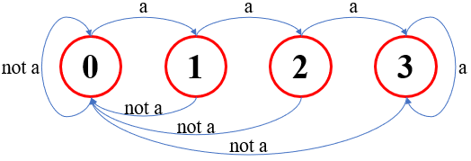
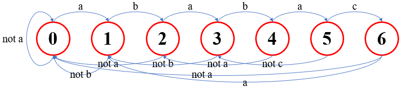
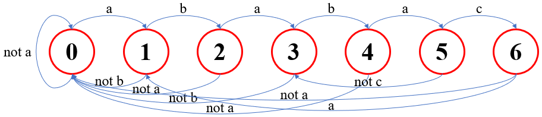
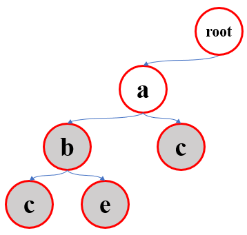
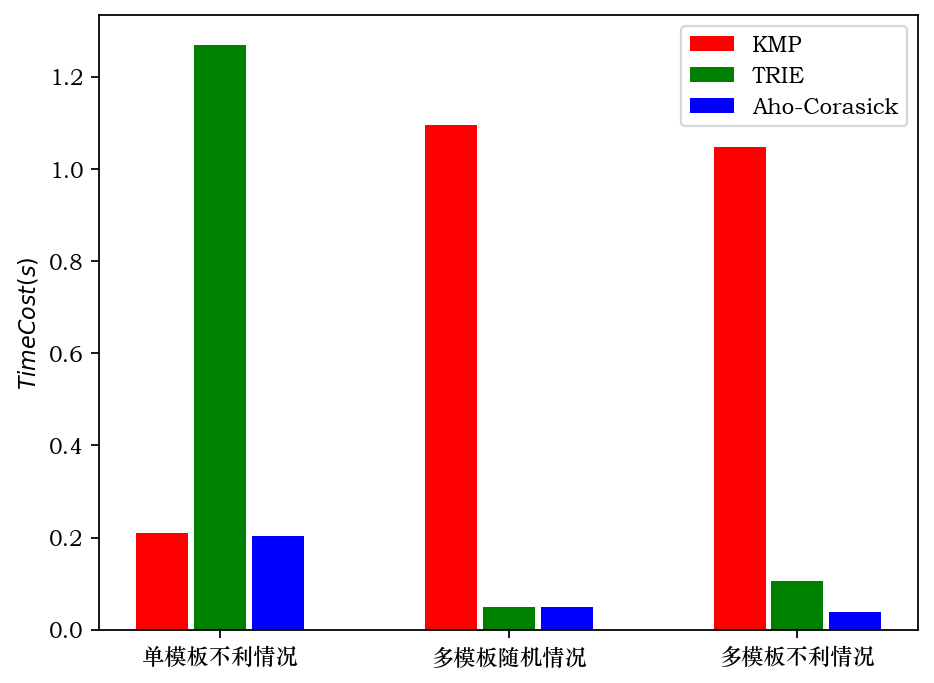

# Report: Lab4 AhoCorasick

刘滨瑞 未央-水木12 2021012579

## Ⅰ 提交说明

提交的压缩包的目录结构如下。

```c
lab4AhoCorasick_刘滨瑞2021012579.zip
│ report.md
│
└───pics
│
└───checkit
│ │ generator.py
│ │ monitor.ipynb
│ │
│ └───input
│ └───A
│ └───B
│ └───C
│
└───src
  │ KMP.cpp
  │ TRIE.cpp
  │ Aho-Corasick.cpp
```

- `report.md`是实验报告。
- `pics`文件夹内是实验报告中的图片与表格。
- `checkit`文件夹内是测试用脚本文件。
`checkit/generator.py`是**测例生成器**，能够按特定规则生成测例文件，储存在`checkit/input`中。
`checkit/monitor.ipynb`是测试器，负责比对三种算法在生成测例下的输出结果，并能够图表的形式输出耗时统计。
`checkit/A`、`checkit/B`、`checkit/C`文件夹内是分别是**KMP算法**、**TRIE算法**和**AC自动机算法**的编译文件和程序的输出结果。
- `src`文件夹内是实验的源代码。
`src/KMP.cpp`是实现**KMP算法**的源代码。
`src/TRIE.cpp`是实现**TRIE算法**的源代码。
`src/Aho-Corasick.cpp`是实现**AC自动机算法**的源代码。

编译选项为：-O2。

## Ⅱ 任务报告

### 任务1



### 任务2



### 任务3



### 任务4



### 任务5

代码内容参见`src/KMP.cpp`、`src/TRIE.cpp`文件。

测例的构造思路与测试结果参见**Ⅲ 算法测试**部分。

### 任务6

代码内容参见`src/Aho-Corasick.cpp`文件。

可使用`checkit`中的脚本进行对拍。建议先运行`checkit/generator.py`生成测例，再运行`checkit/monitor.ipynb`比对程序的输出。

AC自动机算法的自学主要参考了以下网站的内容：

- （1）https://zhuanlan.zhihu.com/p/368184958
- （2）https://oi-wiki.org/string/ac-automaton

我首先在网站（1）学习了算法的主要思想，并完成了初步的代码实现。
在算法的完善与调试环节，我参考了网站（2）的演示与示例代码。
学习过程中，我没有使用任何人工智能工具。

### 任务7

测例的构造思路与测试结果参见**Ⅲ 算法测试**部分。

### 任务8

在字符集很大的情况下，键树中每个节点的分支因子可能会很大。因此，如果我们仍然使用数组或`vector`存储子节点的位置，会导致键树的空间复杂度过高，也会使得查找子节点的时间消耗过大。

我们注意到一个事实，虽然键树中节点的最大分支因子很大，但在几乎所有情况下，键树实际存在的节点数并不多。基于此，一种可行的思路是采用`hashmap`结构储存子节点的位置，可以保证在常数时间和空间内完成子节点位置的储存与查找操作。

另外一种思路是，可以将通过一定的编码方式，将大型字符集转换为小字符集，进而可以使用任务6中的算法。编码方式可以使用通用的`GB2312`或`Unicode`编码，也可以根据具体字符集构造Huffman编码树。

## Ⅲ 算法测试

我们构建了四组测例，三种算法在各组测例下有着不同的表现。

**1. 单模板不利情况**
【测例编号71~80.】

不利情况指的是蛮力算法的最坏情况。即总是比对至模板串的最后一位才发生不匹配并回溯。KMP算法和AC自动机算法能够有效地优化该类情况，因为它们通过next表和fail指针约束了回溯过程。本情况下取模板串的数量为$1$，因此TRIE算法和AC自动机算法的多模板优化没有效果。
**综上，在本组测例下，TRIE算法的效率较差，KMP算法和AC自动机算法的效率相近且较优。**
如下图所示，测试器的统计结果证明了我们的构想。

具体的代码实现参见`checkit/generator.py`中的`gen_unlucky()`函数。
实现思路是：令模板串总是形如“aaaa...ab”，而文本串总是形如“aaaaa...”。

参数：模板串长为$10^3$，文本串长为$10^7$，模板串数量为$1$。

**2. 多模板随机情况**
【测例编号81~90.】

在随机选取模板串与文本串时，几乎总是不会匹配成功，因此KMP算法和AC自动机算法的回溯防止不能起到优化效果。而在多模板串的情况下，TRIE算法和AC自动机算法可以避免逐个比对模板串，应有着较高的效率。
**综上，在本组测例下，KMP算法的效率较差，TRIE算法和AC自动机算法的效率相近且较优。**
如下图所示，测试器的统计结果证明了我们的构想。

具体的代码实现参见`checkit/generator.py`中的`gen_average()`函数。
实现思路是：随机生成模板串与文本串。

参数：模板串长$100$，文本串长$10^6$，模板串数量为$500$。

**3. 多模板不利情况**
【测例编号91~100.】

结合上面两类测例，在多模板串条件与KMP算法的不利情况下，**AC自动机算法的效率较优，而KMP算法和TRIE算法的效率较差**。如下图所示，测试器的统计结果证明了我们的构想。

参数：模板串长$100$，文本串长$5\times10^5$，模板串数量为$1000$。

**4. 单模板随机情况**
【测例编号1~70.】

与情况3相对地：在单模板串条件与随机情况下，三种算法的效率相似。

### 三种算法在不同测例下的耗时统计



## Ⅳ 完成时间估计

### 8小时

其中自学约1.5小时，编写源代码约3小时，编写数据生成器与对拍器约1.5小时，debug约1小时，完成report约1小时。
