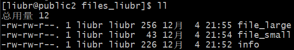
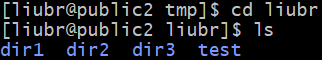
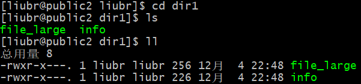
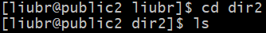
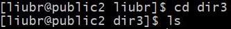
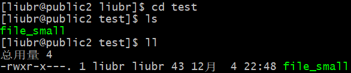

# Homework7 实验报告：shell脚本

## 完整脚本代码

```shell
# !/bin/bash

# Task 1
for i in 1 2 3
do
    mkdir -p /tmp/liubr/dir$i
done

# Task 2
cd /tmp/liubr

# Task 3
cp -r /tmp/files_liubr test

# Task 4
chmod -R 750 test

# Task 5
find test -type f -size +100c | awk '{system("mv "$0" /tmp/liubr/dir1")}'

```

## 实验内容

### Task 1

**要求：利⽤for循环创建⽬录/tmp/dir1，/tmp/dir2和/tmp/dir3。**

为了避免和其他同学在测试时发生冲突，我在`/tmp`文件夹下新建了一个名为`liubr`文件夹。后面的测试任务均在`/tmp/liubr`文件夹中执行，而不是`/tmp`文件夹。

在这里使用了`mkdir`命令创建目录，添加参数`-p`以保证目录名称存在，否则新建一个。

### Task 2

**要求：切换⼯作⽬录⾄/tmp。**

使用`cd`命令即可。

### Task 3

**要求：复制/etc/pam.d⽬录到当前⽬录，并重命名为test。**

因为权限问题，我无法访问`/etc/pam.d`目录。因此，我在`/tmp`文件夹下新建了一个名为`files_liubr`的文件夹用于复制测试。如下图所示，该文件夹中有三个文件，其中`info`和`file_large`⼤于100Bytes，`file_small`小于100Bytes。



使用`cp`命令执行复制，添加`-r`参数以复制目录及其所有的子目录与文件。

### Task 4

**要求：将test⽬录及⽬录中的⽂件的权限均修改为750。**

使用`chmod`命令即可，添加`-R`参数以执行递归操作。

### Task 5

**要求：利⽤awk⼯具将test下⼤于100Bytes的⽂件转移到/tmp/dir1⽬录下。**

使用`find`命令，在`test`目录下查找所有类型为文件(`-type f`)且大小大于100字节(`-size +100c`)的文件。通过管道将查询结果传递至后一个命令。

最后使用`awk`工具，将查询结果中的所有文件移动到了指定目录中。

## 实验结果

最后，我们运行脚本，然后在`/tmp/liubr`目录中检查运行结果，具体内容如下图所示。











结果符合预期，说明脚本顺利地实现了作业所要求的功能。
