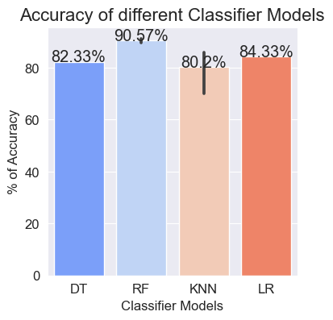

# Report: 情感分类问题

刘滨瑞 未央-水木12 2021012579

## 数据处理 Data Processing

### 预处理

代码实现参见`preprocess()`函数。

该函数接受文本输入，将文本中除字母、数字、空格外的字符全部替换为空格，并将字母字符全部转换为小写，最后输出处理后的文本。

## 特征工程 Feature Engineering

### 特征抽取

手动实现了`sklearn.CountVectorizer`类，代码实现参见`ManualVectorizer`类。

经实验，选择`sklearn.CountVectorizer`作为数据向量化方法效果较好。

经实验，不进行维度缩减，模型效率仍然可以接受。而使用维度缩减方法反倒会降低模型最终的效果。因此，我们没有采用维度缩减方法。

## 模型选择 Model Selection

### 交叉验证

使用`sklearn.train_test_split()`函数，将训练数据按比例划分为训练集和验证集，比例为8：2。

### 模型实现

选择的模型为：

- model_0：决策树

经实验，参数为`criterion = 'entropy'`，其余默认时，效果较好。
在验证集中，准确率为$82.33\%$。
耗时：17.2s。

- model_1：随机森林

经实验，参数为`n_estimators=90`，其余默认时，效果较好。
在验证集中，准确率为$91.08\%$。
耗时：6min20.0s。

- model_2：K近邻算法

经实验，参数为`n_neighbors = 4`，其余默认时，效果较好。
在验证集中，准确率为$85.97\%$。
耗时：20.6s。

- model_4：逻辑回归

该模型没有调用`sklearn`，而是基于梯度下降算法**手动实现**。

经实验，参数为`lr = 0.001, iter = 1000, lam = 0.1`，其余默认时，效果较好。
在验证集中，准确率为$84.33\%$。
耗时：16.7s。

各模型在验证集中的准确率对比可参考下图。

关于各模型的效率，除随机森林外，均可在20s左右的时间内完成训练。
随机森林的效率相对较低，这是由模型中决策树的数量较多所致。

### 效果评估

综合考虑各模型表现，我们选择**随机森林**作为最终模型。

在测试集中，随机森林模型的准确度为95.1%，高于在验证集中的准确率。

经测试，各个模型在测试集中的准确率均高于在验证集中的准确率，这可能是因为在测试集中混入了训练集中的数据。
