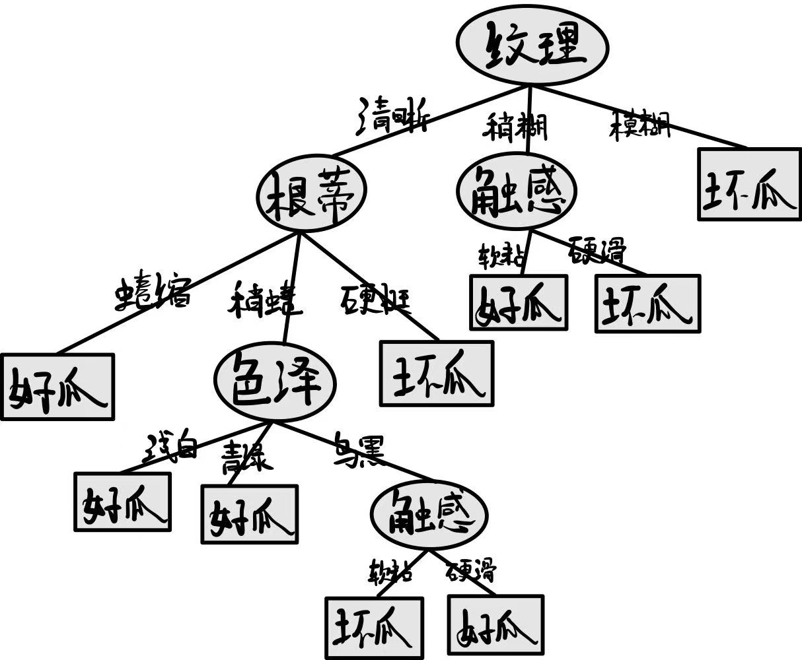
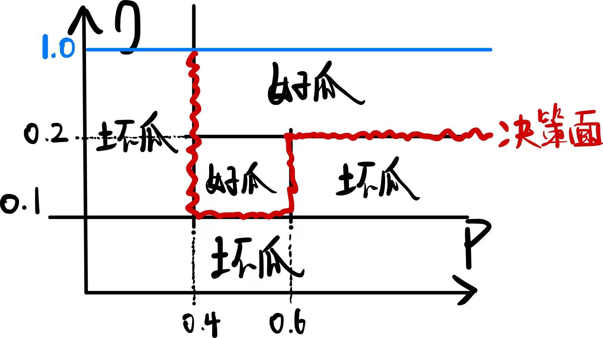
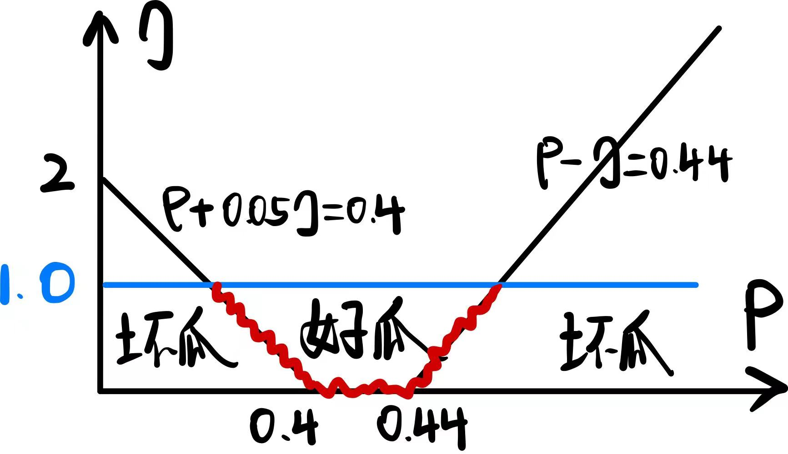
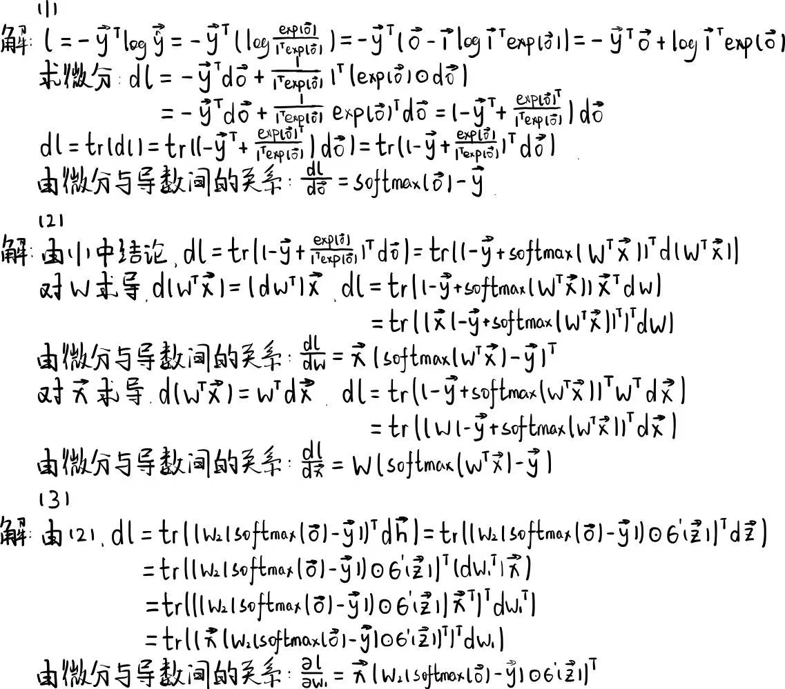
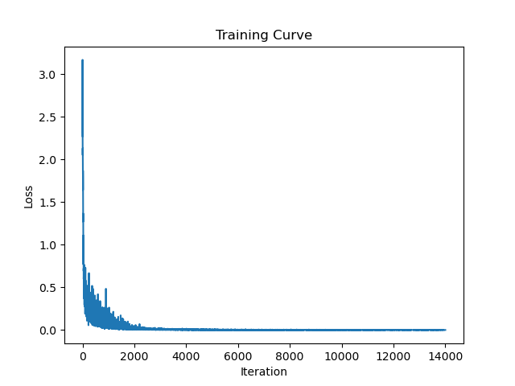

# 人工智能导论第二次作业

## Ⅰ 第一题

### (1)

如果只划分训练集和测试集，说明我们是在根据测试集上的表现来选择算法或模型。这会使得我们最后得到的算法或模型过度拟合测试集的数据，因而具备较差的泛化能力，即所谓的“幸运模型”。

在引入验证集后，我们将利用验证集的数据对算法或模型进行评估、选择和调整，在这个过程中选择出表现最好的算法、模型和超参数。而测试集仅用于在训练结束后，对模型进行一次最终的评估，以衡量模型在一般数据下的表现。

### (2)

1. 首先，从整个数据集中划分出一部分作为测试集，剩余的部分记作$\mathbb{D}$。
2. 将$\mathbb{D}$划分为$K$个子集，记为$\mathbb{D}_1、\mathbb{D}_2、...、\mathbb{D}_K$。
3. 对每一个$\mathbb{D}_i$，我们将$\mathbb{D}/\mathbb{D}_i$作为训练集，将$\mathbb{D}_i$作为验证集。如此我们即得到了$K$组可用于模型训练的训练-验证数据组。
4. 分别统计$K$组数据的评估结果（损失函数值），将其平均值作为模型的整体评价指标。

### (3)

从几何的角度看，L1正则化要求权重$\boldsymbol{\omega}$在一个超立方体范围内，而L2正则化要求权重$\boldsymbol{\omega}$在一个超球体范围内。因此，相较于L2正则化，L1正则化更倾向于$\boldsymbol{\omega}$的某些维度的值为$0$的情况，因此可以得到$\boldsymbol{\omega}$的稀疏解，从而能够选择出最重要的一个或多个特征（特征选择）。

另一种正则化方法是Dropout方法。在神经网络中，为了防止模型过拟合，我们可以在训练过程中随机丢弃一部分神经元，并删除其连接。如此可以增加模型拟合的难度，排除掉数据噪声对参数产生的影响，从而有效地提高训练速度和模型的泛化能力。

### (4)

首先，为了解决非线性分类问题，我们会引入基函数$\phi$。通过非线性基函数的变换，非线性分类问题将被转化为线性分类问题，进而可以用SVM处理。

在此过程中，我们需要衡量变换后样本之间的相似度。相似度可以用内积来表示，即$\phi(\boldsymbol{x_1})\cdot\phi(\boldsymbol{x_2})$。但是，在高维度的情况下，如果分别计算$\phi(\boldsymbol{x_1})$和$\phi(\boldsymbol{x_2})$的值，再计算内积，复杂度很高。因此，我们引入了核函数$k(\boldsymbol{x_1},\boldsymbol{x_2})=\phi(\boldsymbol{x_1})\cdot\phi(\boldsymbol{x_2})$。直接使用核函数计算变换后的向量内积，计算量和内存消耗将显著降低。

### (5)

- 每棵决策树使用的数据集均是Bootstrap samples，为随机地从总数据集中有放回地抽样所得。因此，每颗树的训练集一般都各不相同。

- 每颗决策树都不会使用全部特征进行构建，而是会随机地从总特征集中选取一部分。这使得每棵树关注的特征各不相同。

## Ⅱ 第二题

### (1)

训练深度神经网络时，网络在训练集上的误差较小，但在测试集上的误差较大，说明发生了**过拟合**的问题。解决方法有：

- **Dropout方法**

在深度神经网络训练过程中随机丢弃一部分神经元，并删除其连接。如此可以增加模型拟合的难度，排除掉数据噪声对参数产生的影响，降低发生过拟合问题的可能性。

- **Weight decay方法**

发生过拟合问题往往意味着模型过多地拟合了数据中的噪声，一种表现为权重的值过大。因此，我们可以通过在损失函数中加入正比于权重范数的惩罚项，使得权重值趋向于较小的数值，从而避免模型过度拟合训练数据。

### (2)

- **局部性假设（Locality Assumption）**

我们认为，图像的信息存在**局部连接**现象——在某一层级的特征上，单个像素的信息首先和其临近的像素相关。因此，在卷积神经网络中，我们会采用具有局部感受野的感知机。

- **平移不变性假设（Shift Invariance Assumption）**

我们认为，神经网络对处于不同位置的图像特征应具有相同的认知方式。因此，在卷积神经网络中，我们采用了**参数共享**的策略，同一层的感知机应具备相同的模型参数。

### (3)

该网络有七层。

- 第一层：卷积层

含$5\times 5\times 1\times 6=150$个可学习参量。

- 第二层：池化层

不含可学习参量。

- 第三层：卷积层

含$5\times 5\times 6\times 16=2400$个可学习参量。

- 第四层：池化层

不含可学习参量。

- 第五层：全连接层

含$5\times 5\times 16\times 120=48000$个可学习参量。

- 第六层：全连接层

含$120\times 84=10080$个可学习参量。

- 第七层：全连接层

含$84\times 10=840$个可学习参量。

### (4)

ResNet在模型在一般的卷积层后，引入了来自输入的直连项。这使得网络只需拟合输入和输出之间的残差，而非直接对原始特征进行学习，从而减小了模型学习的难度，使之更容易完成优化。

### (5)

- **层归一化（Layer Normalization）**

在CNN中，不同层之间的输入分布可能会发生变化，将引起数值不稳定的问题，导致训练困难。因此，沿batch维度对样本作归一化操作，可以将网络中的数值控制在合理范围内，能够有效缓解该问题。

- **计划采样（Scheduled Sampling）**

在CNN中，若采用真值训练模型，由于在预测值只能用生成值作为输入，将会出现训练-推理失配的问题。为解决该问题，我们可以在训练时以一定的概率使用真值输入，其他情况采用预测值输入，并随着训练进行逐渐降低该概率。如此可以使模型“从易到难”进行学习，逐渐适应生成值的输入，并最终提高模型的预测效果。

## Ⅲ 第三题

### (1)

计算代码参见`p3/*`。

属性 | 信息增益 |
:-: | :-: |
色泽 | $0.109$ |
根蒂 | $0.143$ |
敲声 | $0.141$ |
纹理 | $0.381$ |
脐部 | $0.290$ |
触感 | $0.007$ |

### (2)

### (3)

## Ⅳ 第四题

### (1)/(2)/(3)

（注：(1)、(2)题结果中，微分符号$d$应为偏导符号$\partial$）

### (4)

尝试了$0.05/0.1/0.2/0.01$等学习率，在学习率为$0.05$时，效果最好。

> Accuracy
Top-1 accuracy on the training set : **1.0**
Top-1 accuracy on the validation set : **0.942**
Top-1 accuracy on the test set : **0.9438**

损失函数的训练曲线见下图。

具体实现参见`p4/mlp.py`文件。

## Ⅴ 第五题

代码实现参见`p5/playground.ipynb`文件。
实验报告参见`p5/report.md`文件。