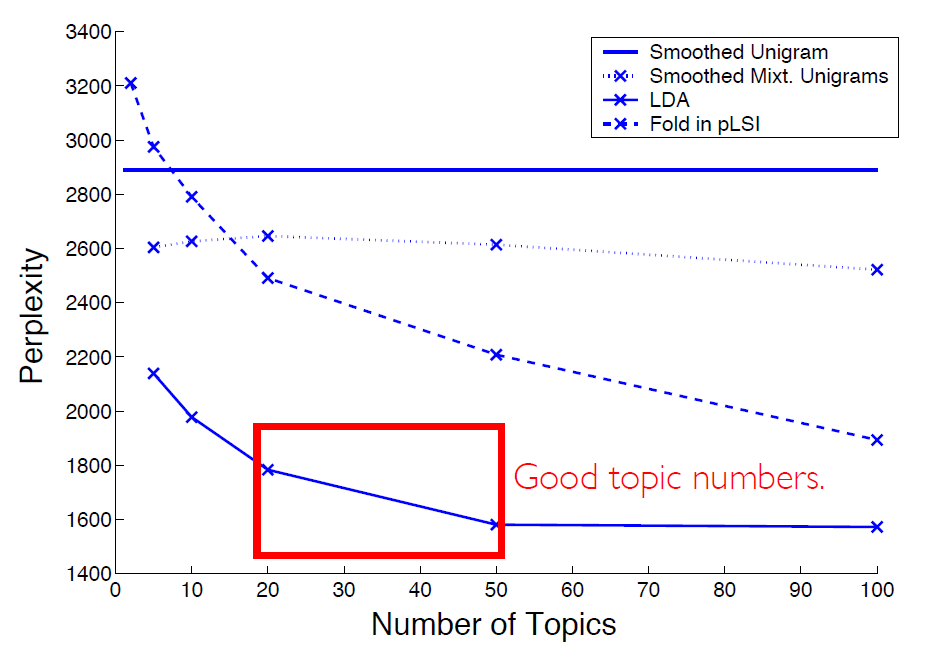

# Report: Baum-Welch算法＆Variational EM LDA

刘滨瑞 未央-水木12 2021012579

## 5 Baum-Welch算法伪代码

1. 初始化参数$\theta=\{\pi=[\pi_i],A=[a_{ij}],B=[b_j[k]]\}$.
2. 使用前后向算法(Forward-Backward-Algorithm)，定义概率计算函数：$\alpha_t(i)=P(z_t=i|X_{1:t},\theta)、\beta_t(i)=P(X_{t+1:T}|z_t=i,\theta)$.
3. 根据`作业解答.pdf`(6)中的计算过程，定义概率计算函数$\gamma_t(i)=P(z_t=i|X,\theta)、\xi_t(i,j)=P(z_t=i,z_{t+1}=j|X,\theta)$.
4. (E step) 更新隐变量$Z$分布：$q(Z)=P(Z|X,\theta)$.
5. (M step) 固定$q(Z)$，调用2.中函数计算$\alpha_t^{old}(i)、\beta_t^{old}(i)$，在此基础上调用3.中函数计算$\gamma_t(i)、\xi_t(i,j)$，最后根据`作业解答.pdf`(7)中的计算过程，更新参数$\theta$.
6. 反复执行4.和5.的过程，直至收敛或到达指定迭代次数。返回推理结果。

## 6 Variational EM LDA

### (a) 伪代码

1. 初始化参数$\alpha$、$\beta$、$\gamma$、$\phi$。其中$\gamma$、$\phi$是变分参数，$\beta$需要根据输入文档的词频信息，用最大似然估计方法初始化。
2. (基于ELBO的参数更新)遍历每一个文档，逐个更新该文档维度上的$\gamma$和$\phi$的值。更新方法是：先利用$\alpha$和该文档的词频信息初始化，然后利用公式(1)迭代更新$\gamma$和$\phi$，直至收敛或到达指定迭代次数。
3. (基于最大似然估计的参数更新)然后利用$\phi$的值，更新$\beta$的值，并基于公式(2)更新$\alpha$的值。
4. 反复执行2.和3.中的过程，直到到达指定迭代次数。返回推理结果。

注：
公式(1)：参见代码266-274行，或论文*Latent Dirichlet Allocation*中的公式(6)、(7)。
公式(2)：参见代码中的函数`update_alpha()`。

### (b)

参见`main.py`。

### (c)

具体输出结果参见`K=5output.txt`、`K=10output.txt`、`K=20output.txt`。

- $K=5$时，主题分类结果为：

0 孩子 学生 老师 学校 家长 女儿 网友 父母
1 老人 民警 小区 告诉 派出所 一位 下午 司机
2 男子 警方 工作 女子 李某 万元 张某 民警
3 发现 民警 警方 现场 医院 嫌疑人 发生 医生
4 公司 法院 儿子 万元 赔偿 情况 银行 相关

- $K=10$时，主题分类结果为：

0 警方 手机 嫌疑人 女子 人员 民警 发现 犯罪
1 男子 医院 现场 村民 警方 事发 死亡 发生
2 孩子 学校 老师 工作 生活 妈妈 学生 事情
3 王某 发现 两人 老人 医生 医院 标题 女子
4 女士 下午 家长 昨日 孩子 介绍 乘客 一位
5 法院 万元 赔偿 公司 判决 证据 判处 被告人
6 儿子 妻子 父母 丈夫 父亲 发现 母亲 离婚
7 网友 派出所 电话 工作 老人 发现 找到 家人
8 民警 学生 车辆 交警 司机 发生 医院 事故
9 公司 小区 情况 相关 部门 工作人员 老板 负责人

- $K=20$时，主题分类结果为：

0 公司 快递 情况 员工 导致 提醒 教练 小时
1 报道 价格 发现 市场 超市 英国 食品 销售
2 司机 车辆 发生 交警 事故 驾驶 乘客 开车
3 孩子 儿子 父母 父亲 妻子 回家 母亲 妈妈
4 学生 学校 老师 家长 同学 孩子 小学 女生
5 发现 警方 民警 派出所 大爷 保护 动物 一只
6 老人 现场 民警 视频 监控 男子 赶到 一位
7 万元 公司 老板 银行 离婚 女士 两人 电话
8 男子 法院 手机 赔偿 张某 审理 证据 抢劫
9 小区 居民 业主 物业 房子 部门 保安 电梯
10 医院 嫌疑人 医生 事发 家属 下午 抢救 调查
11 李某 法院 母亲 被告人 判处 有期徒刑 被害人 死亡
12 网友 医生 信息 电话 公司 微博 治疗 患者
13 民警 王某 男子 发现 警方 朋友 现场 检测
14 中国 成都 游客 旅游 标准 导游 世界 旅行社
15 警方 民警 公安局 嫌疑人 抓获 犯罪 人员 派出所
16 女子 警方 村民 报警 介绍 下午 民警 男子
17 工作 孩子 生活 女性 丈夫 家庭 社会 时间
18 工作人员 男子 美国 标题 近日 希望 报道 遭遇
19 女儿 幼儿园 孩子 妈妈 回家 奶奶 家里 父亲

### (d)

**分类效果最好的是$K=10$时。**

相比于$K=10$时，在$K=5$时，结果中主题有所缺失，如“婚姻”主题。如：`儿子 妻子 父母 丈夫 父亲 发现 母亲 离婚`。

相比于$K=10$时，在$K=20$时，结果中出现了重复的主题。如：`女儿 幼儿园 孩子 妈妈 回家 奶奶 家里 父亲`和`孩子 儿子 父母 父亲 妻子 回家 母亲 妈妈`。

这和论文中的结论相符合：

原因可能为：
随着主题数$K$的增大，模型将更倾向于分离主题相似的词汇。因此，$K$不能太小，才能体现出更明确的主题分类效果。但是，当$K$过大时，也可能会出现过度分类的问题(过拟合)。综上，$K$在一定范围内时，模型的效果最好。
