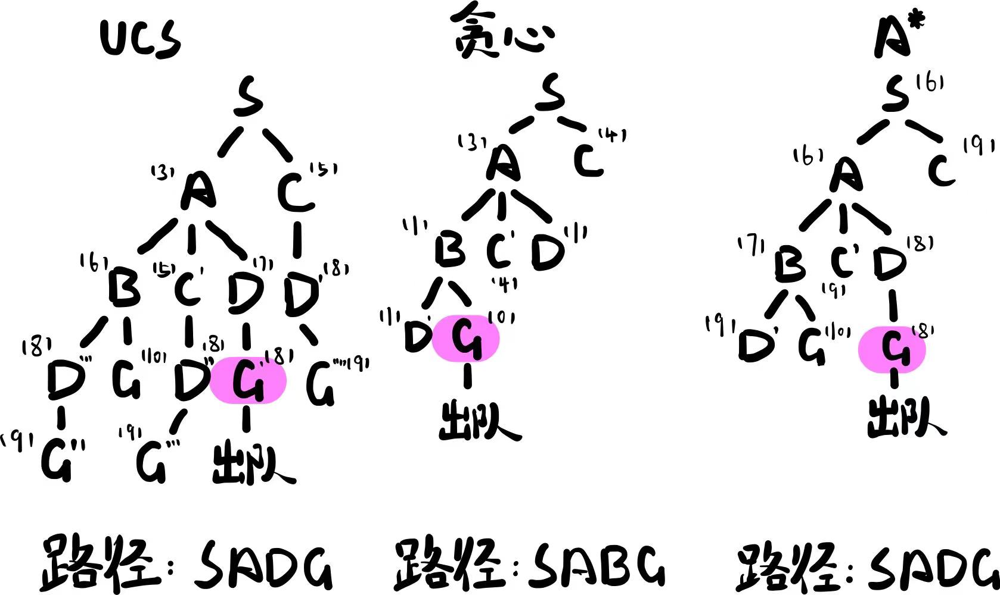

# 人工智能导论第一次作业

## Ⅰ 第一题

### (1)

设搜索目标的深度为$m$。

搜索算法 | 时间复杂度 | 空间复杂度
:-: | :-: | :-:
DFS | $O(d ^ n)$ | $O(dn)$
BFS | $O(d ^ m)$ | $O(d ^ m)$

### (2)

- 树搜索算法没有记忆性，在扩展节点的时候没有作额外的选择。因此树搜索算法往往会重复搜索许多已探索过的节点，也可能会在搜索中引入冗余的搜索路径，甚至是死循环。图搜索算法主要旨在解决这一个问题。

- 在实现上，图搜索引入了一个“已探索集”（explored set）。每次完成一个节点的搜索后，就将该节点加入“已探索集”。而每次在即将添加新的节点至“边缘集”（按某种次序即将被搜索的节点的集合）时，我们只添加未在“已探索集”中的节点。这样即保证了我们不会重复搜索任何一个节点。

### (3)

- 设二元约束关系共有$c$个，节点定义域的最大规模为$d$，则AC-3算法的最坏时间复杂度为$O(cd^3)$。

- 首先，对两个节点作一次强制弧相容操作，需要检查每一个取值对，最坏情况下需要$O(d^2)$的时间。

- 而对每一个二元约束，因为仅会在受约束节点的定义域收缩时进行强制弧相容操作，因此至多会被操作$d$次。

- 故最坏时间复杂度为$O(c\cdot d\cdot d^2)=O(cd^3)$。

### (4)

- 在模拟退火算法中，引入了一个“温度”$T$，$T$随着搜索的进行而逐渐下降。在此算法下，我们在选取搜索后继时引入了随机性，而当$T$越高时，所允许的随机性范围也就越大。

- 因此，在搜索初期，尚且远离最优点时，即使收敛到了局部最优，也会因为较大的随机性而脱离出来。

## Ⅱ 第二题

### 如图所示



## Ⅲ 第三题

### 证明

考虑$T'$为搜索树中真正的代表最优路径的节点。不妨设$T'$并不是我们搜索所得的结果，否则$g(T)=g(T')=h^*(S)\le W\cdot h^*(S)$，结论显然成立。

搜索结果为$T$，$T$将在$T'$之前出边缘集队列。因此必然存在节点$n$，$n$在$T'$的路径上，且在某一时间$n'$和$T$同时在边缘集队列中。

因此：$g(T)=f(T)\le f(n)=g(n)+W\cdot h(n)\le W\cdot(g(n)+h(n))$
而：$g(n)+h(n)\le g(n)+h^*(n)=g(T')=h^*(S)$
结合以上二式，得：$g(T)\le W\cdot h^*(S)$，命题得证。

## Ⅳ 第四题

参见```report.md```和代码。
