# Delphi开发应用程序实验报告

——刘滨瑞 2021012579 未央-水木12

## 实验目的

- 熟悉如何利用**Borland Delphi 7**进行数据库应用的开发。
- 了解开发C/S模式下数据库前端应用的一些基本思路与核心技术。
- 通过数据库应用程序的开发，掌握面向对象的程序设计及可视化编程的一般方法。

## 实验内容

**Borland Delphi 7**是一款专为开发数据库应用程序而设计的**可视化编程工具**，使用**Pascal语言**作为主要语言。

Delphi的优点是采用了“**所见即所得**”的控件式开发方式。使用者只需要拖曳并设置相关控件，Delphi即可自动生成相应的.pas源代码.因此，即使使用者并不懂得Pascal语言，也不影响对Delphi的使用。

在本实验中，将分别使用Delphi的手动编程方式和自动编程方式，将前面实验中建立的DEPT、STU、TEACHER关系，建成主从表的形式，并最终输出**图形化的数据库用户界面**。

## 手动编程方式

### 实验步骤

1. 打开Delphi 7程序。
2. 在“**Data Access**”栏中拖放出“DataSource”图标。
3. 在“**BDE**”栏中拖放出“Table”图标。
4. 在“Table”的参量表中修改“**DatabaseName**”为ODBC数据源名，即“student”，并修改“TableName”为相应关系名。
5. 在“DataSource”的参量表中修改“**Dataset**”，使之指向相应的基本表。
6. 在“**Data Controls**”栏中拖放出“DBGrid”图标，以创建显示窗。在“DBGrid”的参量表中修改“DataSource”，使之指向相应的数据源。
7. 按照2~6的步骤，完成DEPT、STU、TEACHER三个基本表的创建与设置。
8. 在两个从表“Table”的参量表中修改关联表“**MasterSource**”和关联属性“**MasterFields**”，以完成主从表的从属关系定义。
9. 在“Data Controls”栏中拖放出“**Navigators**”图标，将其“DataSource”指向主表，以完成图形化查询按钮的设置。
10. 点击Delphi界面中的绿色三角键，编译运行程序自动生成的.pas源码，即出现应用程序界面。通过界面中的“**Navigators**”接口可进行翻页，插入，删除等操作。

### 结果展示

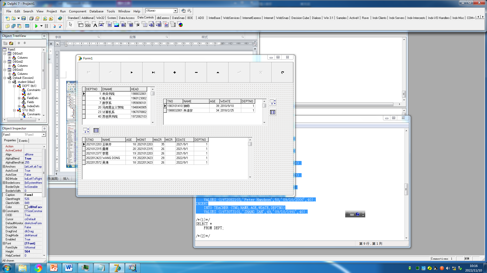

- 手动编程完成后的Form界面

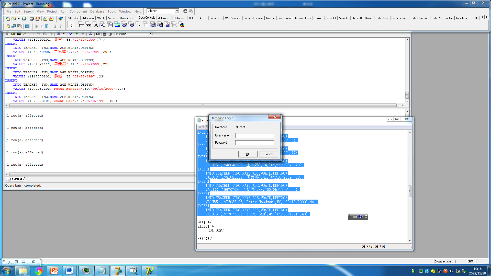

- 编译运行，需要验证数据库访问身份

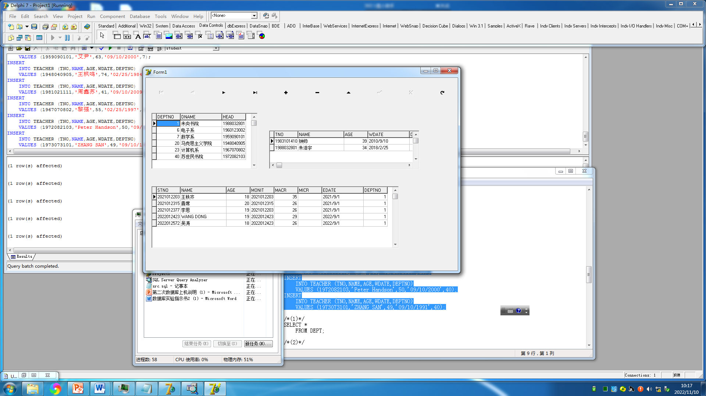

- 利用设置的主从表关系进行数据查询（1）

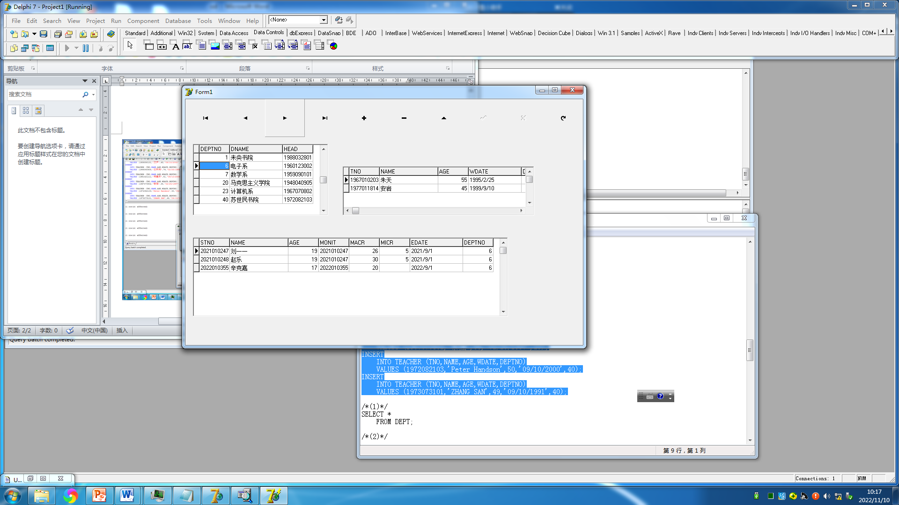

- 利用设置的主从表关系进行数据查询（2）

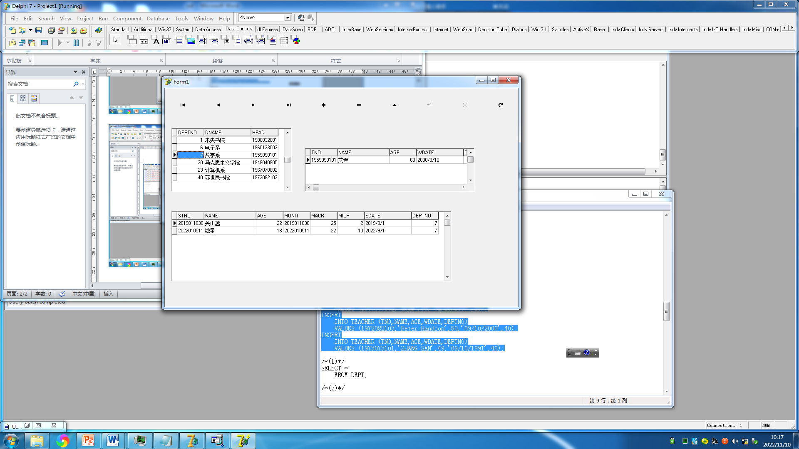

- 利用设置的主从表关系进行数据查询（3）

- 利用设置的主从表关系进行数据查询（4）

- 利用设置的主从表关系进行数据查询（5）

- 利用设置的主从表关系进行数据查询（6）

## 自动编程方式

### 实验步骤

**自动编程方式**是Delphi设计的一种根据使用需要而自动生成图形化界面的一种方式，较传统设计方式更为高效、方便、快捷。

点击“Database”菜单中的“**FormWizard**”启动自动编程，只需根据Delphi给出的提示完成相应设置即可。

过程如下方若干图中所示。

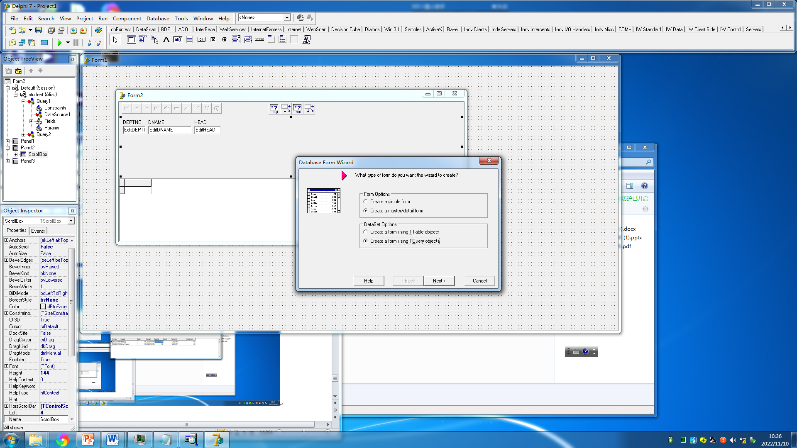

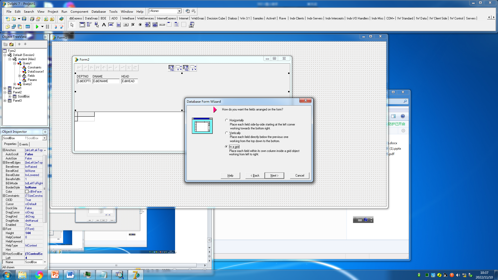

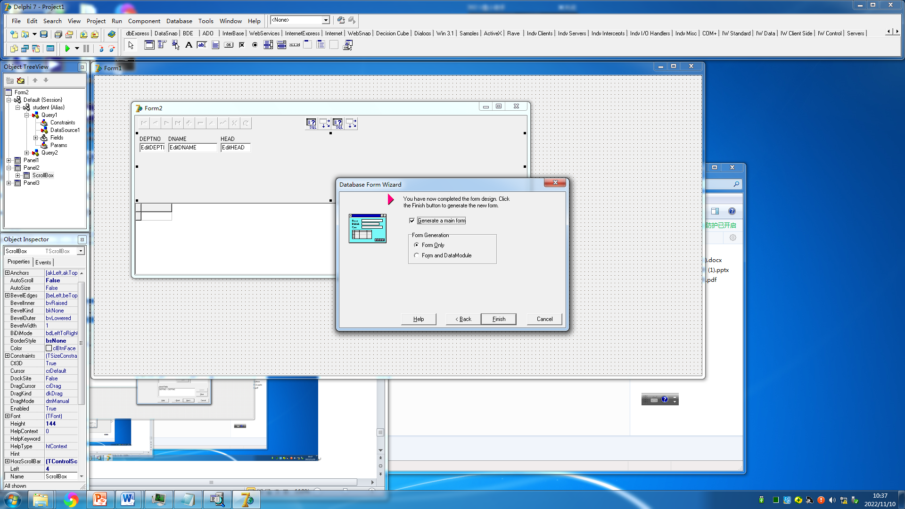

### 结果展示

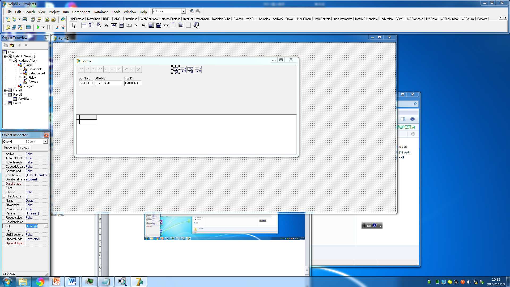

- 手动编程完成后的Form界面

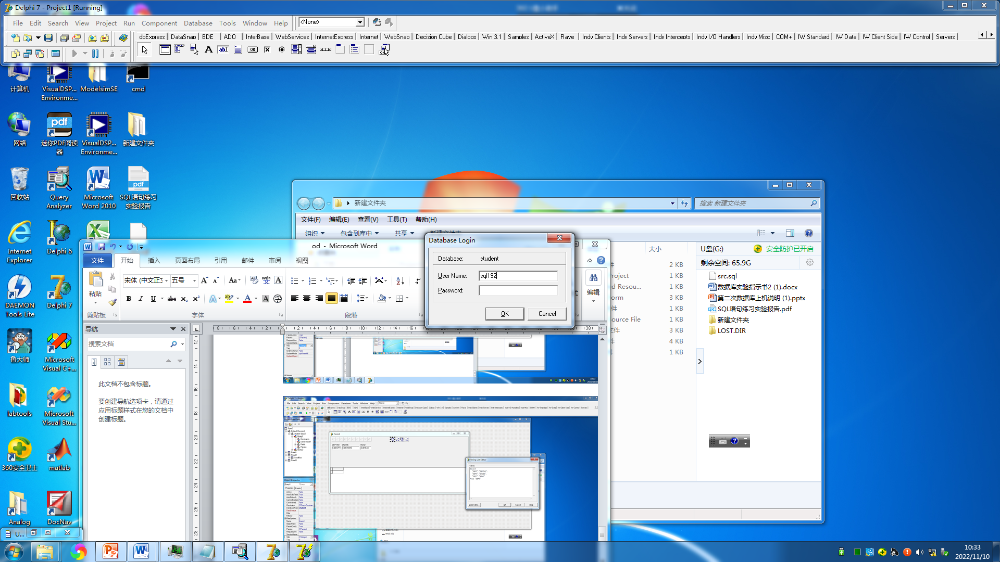

- 编译运行，需要验证数据库访问身份

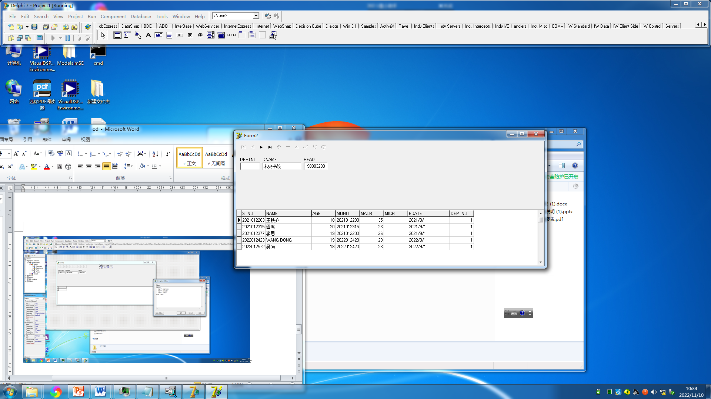

- 利用自动生成的主从表关系进行数据查询（1）

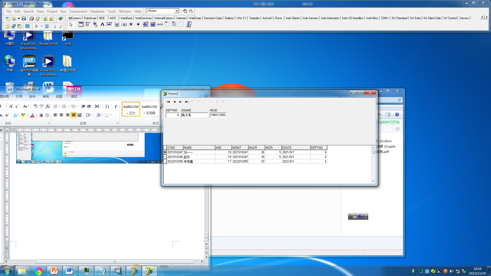

- 利用自动生成的主从表关系进行数据查询（2）

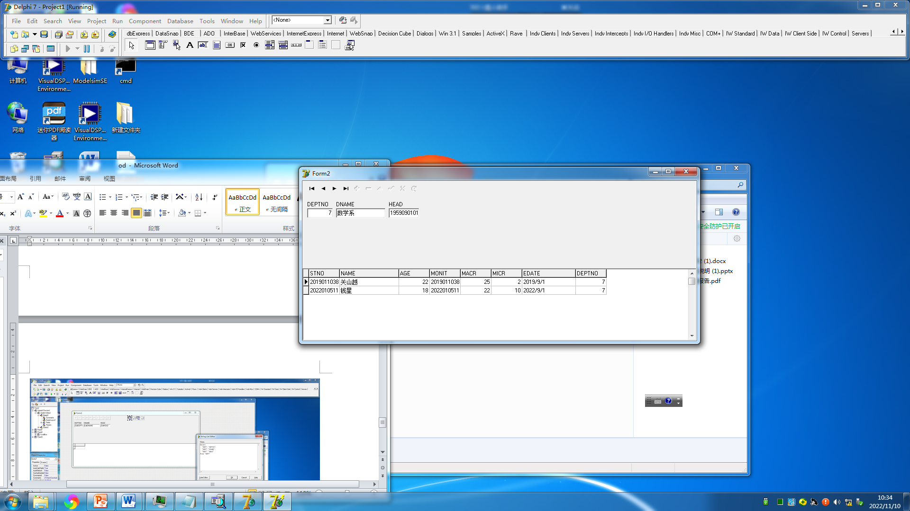

- 利用自动生成的主从表关系进行数据查询（3）

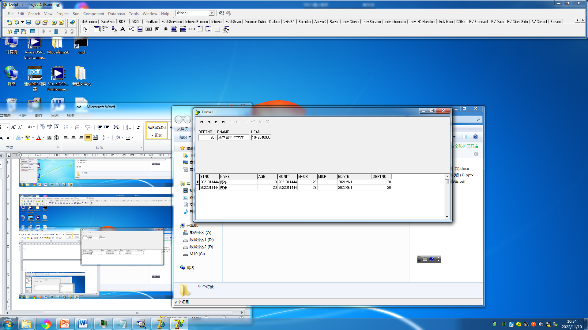

- 利用自动生成的主从表关系进行数据查询（4）

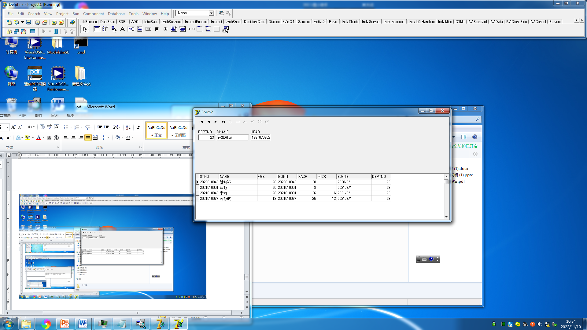

- 利用自动生成的主从表关系进行数据查询（5）

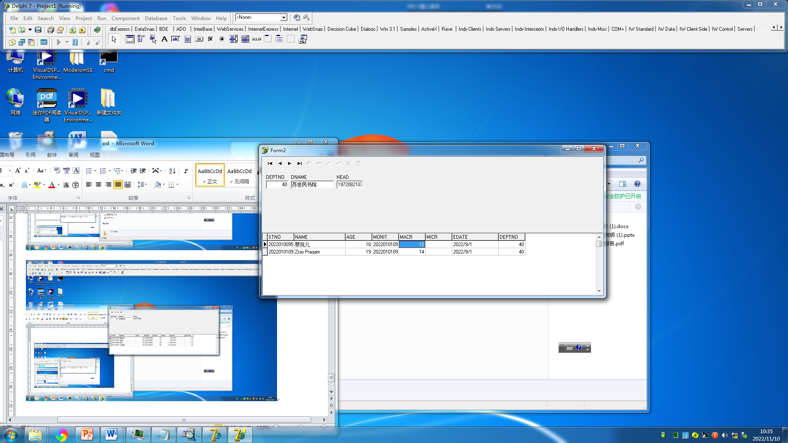

- 利用自动生成的主从表关系进行数据查询（6）

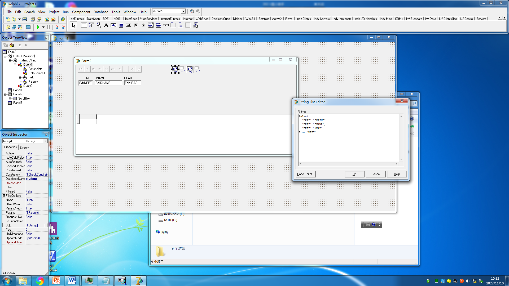

- 自动编程方式生成的源码仍然使用**SQL语言**进行查询。Delphi允许用户调出SQL源码，有必要亦可以进行修改。

## 结果分析与总结

- 由于仍然使用上次实验的数据库，因此需要对数据库内容进行检查。若数据库已被清空，则需要调用上次实验中的SQL-CREATE命令重新创建基本表。
- 控件的参量表中有若干布尔量，可以控制控件的各项属性。注意在编译之前，一定要将“Active”属性修改为True，否则会导致最终无任何输出结果。
- 关系和约束性条件的创建和修改并不是实时进行的，可能存在着缓冲。因此如果在发现修改后无反馈，可稍作等候或刷新。
- 在本实验中，我们使用了Borland Delphi 7软件进行数据库应用的开发，并取得了正确的结果。通过本次实验，我们既对数据库应用程序的开发和面向对象程序设计理念有了更完善的了解，也对SQL语言的工作原理与使用方法更为熟悉。
