# SQL语句练习实验报告

——刘滨瑞 2021012579 未央-水木12

## 实验目的

- 简单认识C/S客户机/服务器模式数据库。
- 了解ODBC技术的基本概念与实现过程。
- 了解SQL Server 2008关系型数据库管理系统，体会其在安全性、数据完整性、一致性、并发控制等方面的功能，并掌握客户端工具的使用方法。
- 实际演练结构化查询语言SQL的基础语法与编写规则，并掌握用Query Analyzer进行数据修改与查询的方法。

## 实验一 ODBC的配置

ODBC（Open Database Connectivity，开放式数据库互连），是由Microsoft建立的数据库技术规范，提供了一组访问数据库的标准API。这些API利用SQL来完成其大部分任务，而ODBC本身也提供了对SQL语言的支持。

用户可以直接将SQL语句发送给ODBC，从而在数据库中完成修改或查询操作。应用程序也可以通过访问不同的数据源（DataSource）来访问相应数据库服务器。通过ODBC技术，我们即解决了不同数据库之间由于数据格式不同而难以互连访问的问题。

### 实验步骤

#### 配置ODBC

1. Windows操作系统下，在控制面板的管理工具中即可找到数据源（ODBC）设置入口。
2. 在用户DSN中选择“添加”，选择添加“SQL Server”驱动程序。
3. 按要求输入数据库的名称，服务器名和登陆ID。（注意不要输入密码）
4. 选择TCP/IP网络库。
5. 其余设置均遵从默认设置，即可完成ODBC的配置。

#### 使用SQL Server客户端

1. 在系统程序中打开Microsoft SQL Server\Query Analyzer。
2. 输入配置ODBC时设置的服务器名与登录ID。
3. 其余设置均遵从默认设置，即可进入Query Analyzer。

## 实验二 SQL语言练习

### 1. 基本表与索引的创建

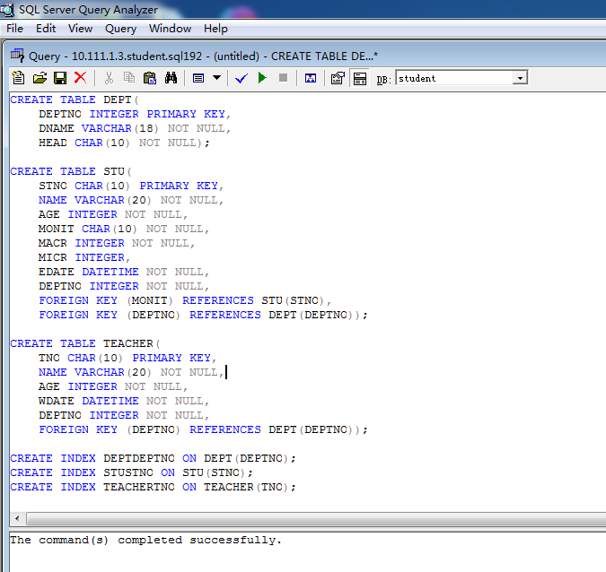

    CREATE TABLE DEPT(
        DEPTNO INTEGER PRIMARY KEY,
        DNAME VARCHAR(18) NOT NULL,
        HEAD CHAR(10) NOT NULL);

    CREATE TABLE STU(
        STNO CHAR(10) PRIMARY KEY,
        NAME VARCHAR(20) NOT NULL,
        AGE INTEGER NOT NULL,
        MONIT CHAR(10) NOT NULL,
        MACR INTEGER NOT NULL,
        MICR INTEGER,
        EDATE DATETIME NOT NULL,
        DEPTNO INTEGER NOT NULL,
        FOREIGN KEY (MONIT) REFERENCES STU(STNO),
        FOREIGN KEY (DEPTNO) REFERENCES DEPT(DEPTNO));

    CREATE TABLE TEACHER(
        TNO CHAR(10) PRIMARY KEY,
        NAME VARCHAR(20) NOT NULL,
        AGE INTEGER NOT NULL,
        WDATE DATETIME NOT NULL,
        DEPTNO INTEGER NOT NULL,
        FOREIGN KEY (DEPTNO) REFERENCES DEPT(DEPTNO));

    CREATE INDEX DEPTDEPTNO ON DEPT(DEPTNO);
    CREATE INDEX STUSTNO ON STU(STNO);
    CREATE INDEX TEACHERTNO ON TEACHER(TNO);

首先在数据库中建立待查询的三个基本表：DEPT（系信息表）、STU（学生信息表）、TEACHER（教师信息表），并为其第一行创建索引。

- 使用CREATE TABLE与CREATE INDEX语句建立基本表和索引

需要在创建基本表时给出**完整性约束条件**。例如在列级需要指定主码(PRIMARY KEY)和非空(NOT NULL)属性，在表级需要添加关联外码(FOREIGN KEY)的限制。

创建**索引**的原因是为了加快查询速度。

结果显示：**The command(s) completed successfully.**
说明我们已经成功创建了基本表及其索引。

### 2. 向基本表中插入数据

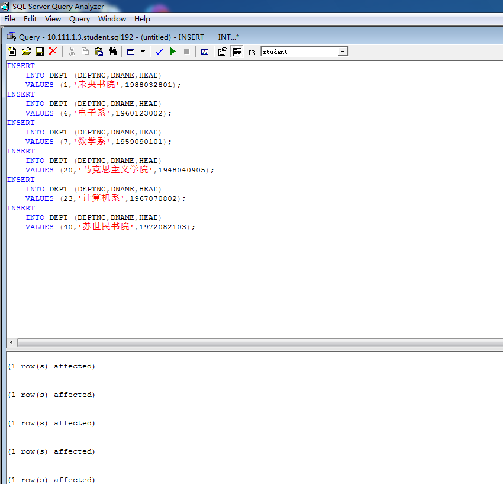
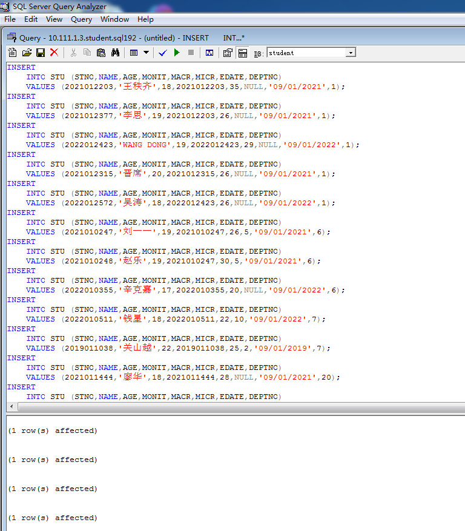
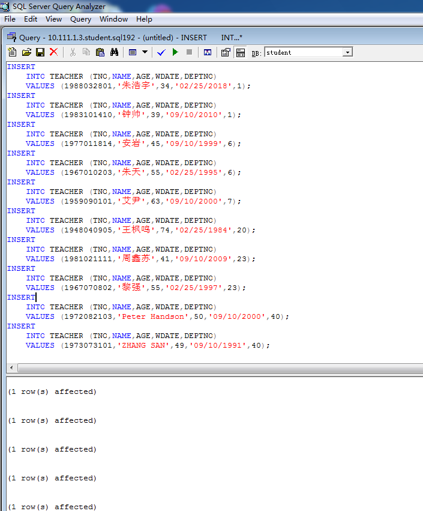

    INSERT
        INTO DEPT (DEPTNO,DNAME,HEAD)
        VALUES (1,'未央书院',1988032801);
    ......

    INSERT
        INTO STU (STNO,NAME,AGE,MONIT,MACR,MICR,EDATE,DEPTNO)
        VALUES (2021012203,'王秩齐',18,2021012203,35,NULL,'09/01/2021',1);
    ......

    INSERT
    INTO TEACHER (TNO,NAME,AGE,WDATE,DEPTNO)
    VALUES (1988032801,'朱浩宇',34,'02/25/2018',1);
    ......

向三个基本表中插入自行设计的若干数据。

- 使用INSERT语句插入数据

在插入数据时需要要注意基本表的**完整性约束条件**，否则系统会直接报错，导致数据插入失败。

结果显示若干行：**(1 row(s) affected).**
说明我们已经成功在三个基本表中插入了我们所设计的数据。

### 3. 数据查询

在已经插入数据的基本表中按相应要求进行查询操作。

- 使用SELECT语句进行数据查询

#### （1）查询DEPT中有那些数据

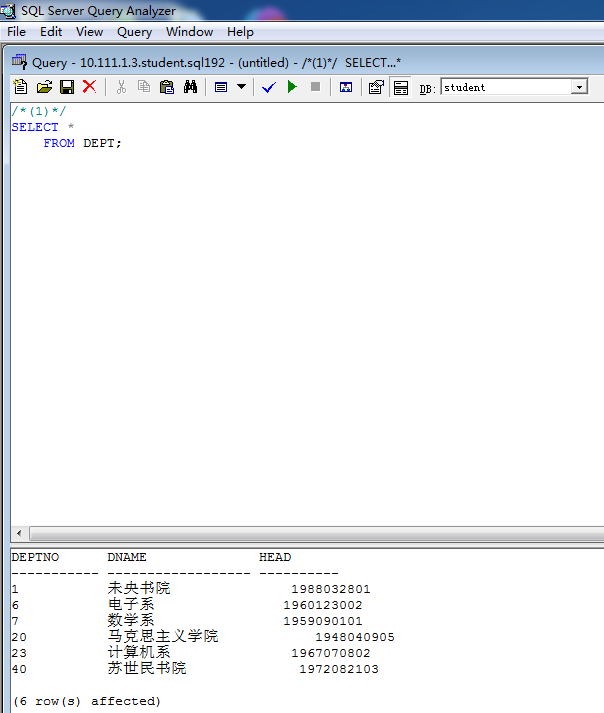

    /*(1)*/
    SELECT *
        FROM DEPT;

- 查询全部数据时，不必要指明所有列名，而可用“ * ”指代。

**查询成功并返回了结果。具体的查询的指令和相应结果参见上图。**

#### （2）查询每个学生的姓名、年龄和主修学分，并按照主修学分由高到低排序

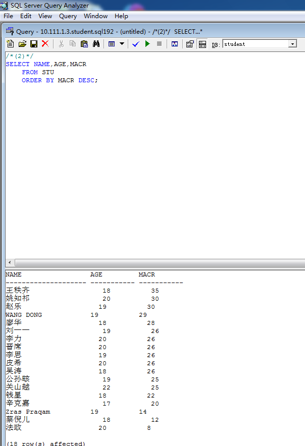

    /*(2)*/
    SELECT NAME,AGE,MACR
        FROM STU
        ORDER BY MACR DESC;

- 对查找结果作排序，使用ORDER BY语句，用DESC关键词指定降序

**查询成功并返回了结果。具体的查询的指令和相应结果参见上图。**

#### （3）查询23号系的学生姓名

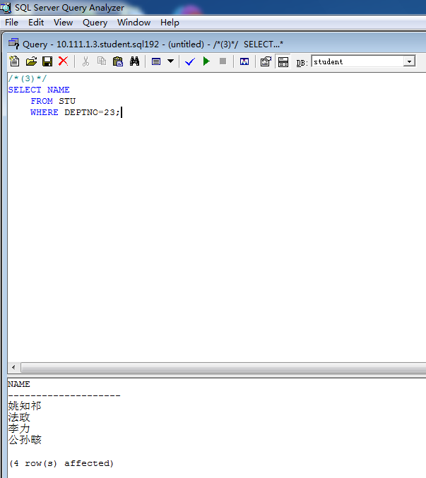

    /*(3)*/
    SELECT NAME
        FROM STU
        WHERE DEPTNO=23;

- 使用WHERE语句添加查询条件

**查询成功并返回了结果。具体的查询的指令和相应结果参见上图。**

#### （4）查询入学日期在2019.1.1与2021.1.1之间的学生姓名

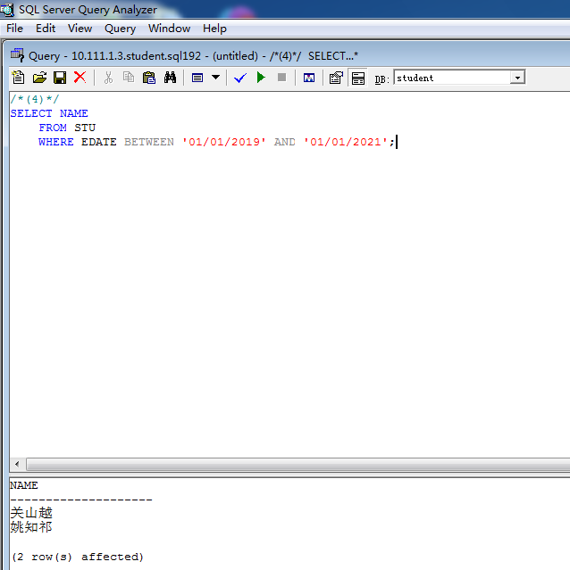

    /*(4)*/
    SELECT NAME
        FROM STU
        WHERE EDATE BETWEEN '01/01/2019' AND '01/01/2021';

- 时间格式为“MM/DD/YYYY”
- 使用BETWEEN语句构造数据区间

**查询成功并返回了结果。具体的查询的指令和相应结果参见上图。**

#### （5）按系给出学生人数以及所选学分(主修+辅修)的平均值

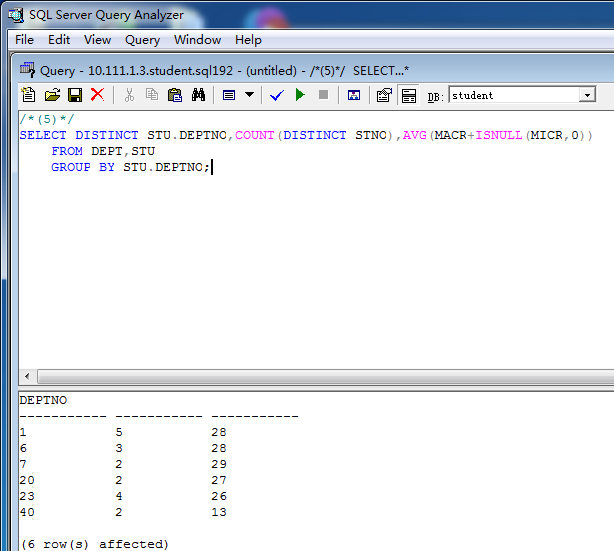

    /*(5)*/
    SELECT DISTINCT STU.DEPTNO,COUNT(DISTINCT STNO),AVG(MACR+ISNULL(MICR,0))
        FROM DEPT,STU
        GROUP BY STU.DEPTNO;

- 使用GROUP BY语句作分组查询
- 使用集函数COUNT、AVG统计数值信息
- 辅修字段可能为空，可用ISNULL(MICR,0)函数将辅修学分转换为0
- 注意使用DISTINCT语句对查询结果进行去重

**查询成功并返回了结果。具体的查询的指令和相应结果参见上图。**

#### （6）查询DEPTNO=20的所有主修学分大于平均主修学分的学生信息

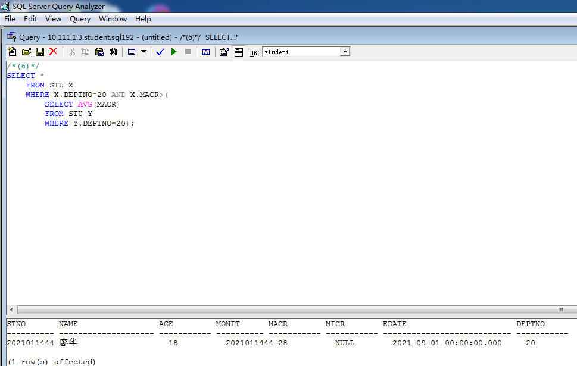

    /*(6)*/
    SELECT *
        FROM STU X
        WHERE X.DEPTNO=20 AND X.MACR>(
            SELECT AVG(MACR)
            FROM STU Y
            WHERE Y.DEPTNO=20);

- 灵活使用嵌套查询与集函数以进行复杂的条件查询
- 在嵌套查询时，如果需要避免指代不明的问题，可以为基本表指定别名

**查询成功并返回了结果。具体的查询的指令和相应结果参见上图。**

#### （7）查询入学时间最早且系编号为23的学生信息

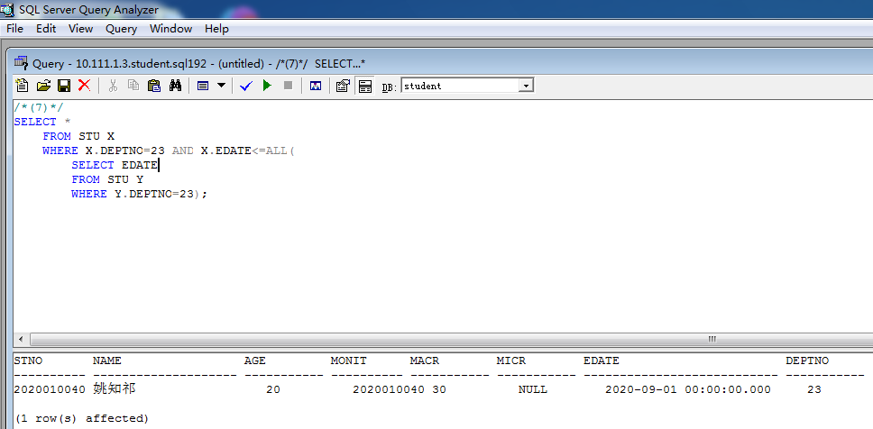

    /*(7)*/
    SELECT *
        FROM STU X
        WHERE X.DEPTNO=23 AND X.EDATE<=ALL(
            SELECT EDATE
            FROM STU Y
            WHERE Y.DEPTNO=23);

- 使用ALL语句描述“最早”等最值性条件

**查询成功并返回了结果。具体的查询的指令和相应结果参见上图。**

#### （8）查询学生WANG DONG所在的系的名称和编号

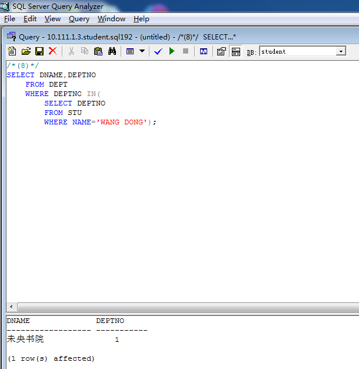

    /*(8)*/
    SELECT DNAME,DEPTNO
        FROM DEPT
        WHERE DEPTNO IN(
            SELECT DEPTNO
            FROM STU
            WHERE NAME='WANG DONG');

- 使用IN语句和嵌套查询来表达条件的嵌套

**查询成功并返回了结果。具体的查询的指令和相应结果参见上图。**

#### （9）将学生学分与其班长相比，查出其主修学分至少与其班长相同的学生学号

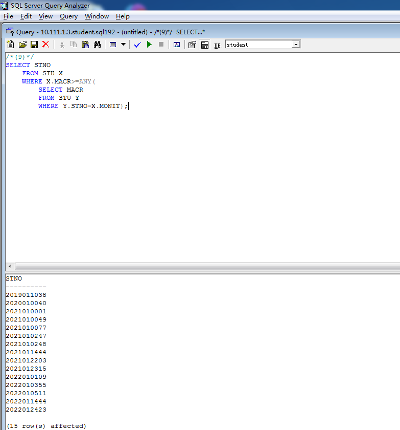

    /*(9)*/
    SELECT STNO
        FROM STU X
        WHERE X.MACR>=ANY(
            SELECT MACR
            FROM STU Y
            WHERE Y.STNO=X.MONIT);

- 使用ANY语句描述“至少”等限制性条件

**查询成功并返回了结果。具体的查询的指令和相应结果参见上图。**

#### （10）查与教师ZHANG SAN同系的学生学号和姓名

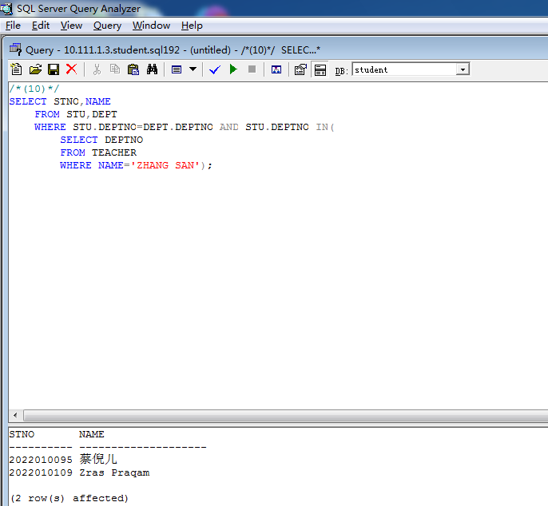

    /*(10)*/
    SELECT STNO,NAME
        FROM STU,DEPT
        WHERE STU.DEPTNO=DEPT.DEPTNO AND STU.DEPTNO IN(
            SELECT DEPTNO
            FROM TEACHER
            WHERE NAME='ZHANG SAN');

- 在WHERE语句中将不同基本表中的量作等式，可以进行基本表的自然连接

**查询成功并返回了结果。具体的查询的指令和相应结果参见上图。**

#### （11）查参加工作时间比其所在系的系主任早的教师姓名和所在的系名

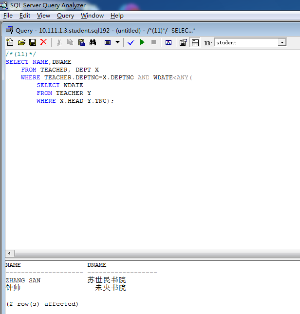

    /*(11)*/
    SELECT NAME,DNAME
        FROM TEACHER, DEPT X
        WHERE TEACHER.DEPTNO=X.DEPTNO AND WDATE<ANY(
            SELECT WDATE
            FROM TEACHER Y
            WHERE X.HEAD=Y.TNO);

**查询成功并返回了结果。具体的查询的指令和相应结果参见上图。**

### 4. 视图的创建与查询

**视图**是从一个或几个基本表（或视图）中导出的子表。通过视图我们可以十分方便地观察到所关注的数据。

#### （1）建立电子系学生视图EE_STU

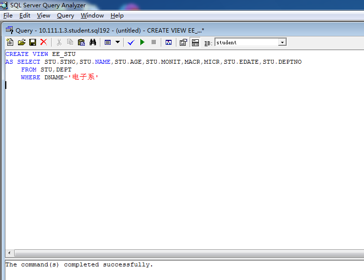

    CREATE VIEW EE_STU
    AS SELECT STU.STNO,STU.NAME,STU.AGE,STU.MONIT,MACR,MICR,STU.EDATE,STU.DEPTNO
        FROM STU,DEPT
        WHERE DNAME='电子系'

- 使用CREATE VIEW语句建立视图

结果显示：**The command(s) completed successfully.**
说明我们已经成功创建了视图EE_STU。

#### （2）建立系号、系名、系主任姓名的系视图DEPT_VIEW

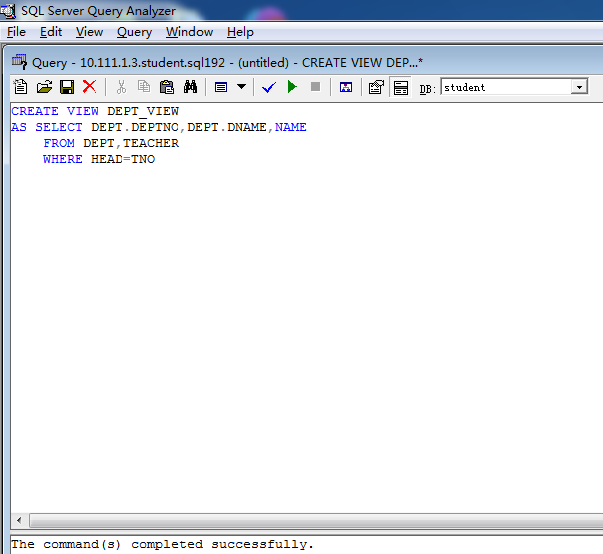

    CREATE VIEW DEPT_VIEW
    AS SELECT DEPT.DEPTNO,DEPT.DNAME,NAME
        FROM DEPT,TEACHER
        WHERE HEAD=TNO

- 使用CREATE VIEW语句建立视图

结果显示：**The command(s) completed successfully.**
说明我们已经成功创建了视图DEPT_VIEW。

#### （3）查视图EE_STU中主修学分最高的学生信息

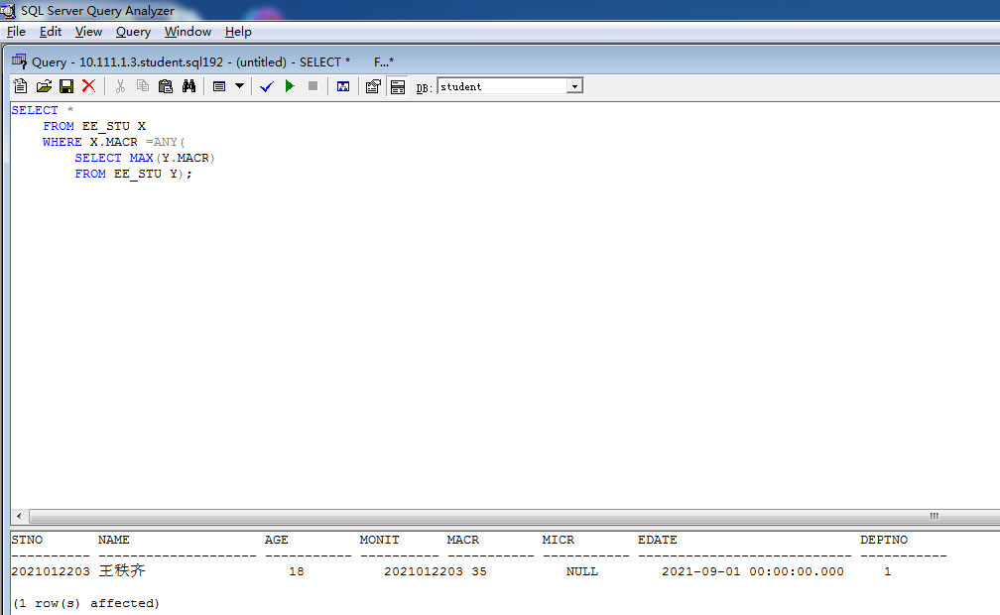

    SELECT *
        FROM EE_STU X
        WHERE X.MACR =ANY(
            SELECT MAX(Y.MACR)
            FROM EE_STU Y);

- 视图的查询和基本表的查询几乎完全一致

**查询成功并返回了结果。具体的查询的指令和相应结果参见上图。**

#### （4）列出系视图DEPT_VIEW的全部信息

    SELECT *
        FROM DEPT_VIEW;

**查询成功并返回了结果。具体的查询的指令和相应结果参见上图。**

### 5. 基本表、索引与视图的删除

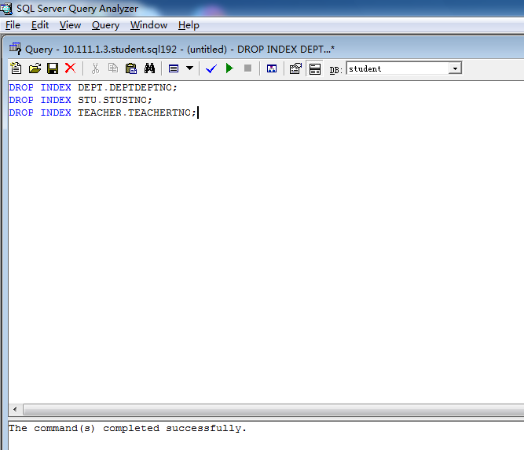
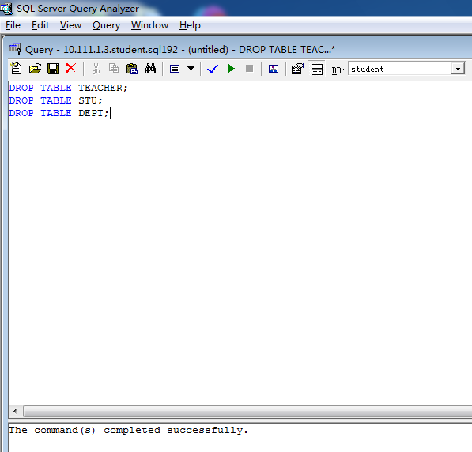
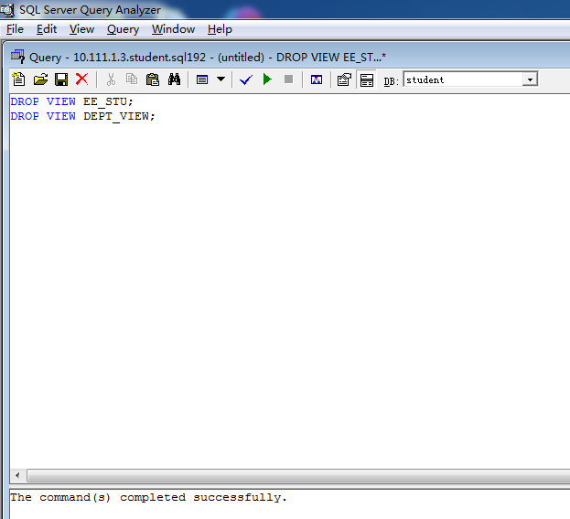

    DROP VIEW EE_STU;
    DROP VIEW DEPT_VIEW;
    DROP INDEX DEPT.DEPTDEPTNO;
    DROP INDEX STU.STUSTNO;
    DROP INDEX TEACHER.TEACHERTNO;
    DROP TABLE TEACHER;
    DROP TABLE STU;
    DROP TABLE DEPT;

- 使用DROP语句进行删除操作

结果显示：**The command(s) completed successfully.**
说明我们已经成功删除了基本表、索引与视图。

由于没有使用级联删除（CASCADE），在删除时需要先删除视图，再删除索引，最后删除基本表，否则将因为约束限制而导致删除失败。
例如，如果直接删除DEPT表，则会返回错误，提示：“未能除去对象‘DEPT’，因为该对象正由一个FOREIG KEY约束引用”。

## 结果分析与总结

- 在配置ODBC时，一定不要设置密码。否则每次修改数据库时，都需要输入密码，会为实验带来大量不便。
- 在创建基本表与索引时，即使不添加索引与约束性限制条件，对本实验也不会有影响。但是出于严谨性考虑，还是应添加索引与约束性限制条件，前者可以加速查询过程，后者则可以保证数据的完整性。
- 在删除基本表后，任何试图访问表和表中数据的行为都会被系统判定为非法，并返回错误。因此应该在实验的最后进行删除操作的实验。
- 在本实验中，我们实际使用了结构化查询语言SQL，完成了十三个查询任务，均得到了正确的结果。我们实践了在前几节课中学习到的SQL语法与查询技巧，也因此对SQL的工作原理与使用方法有了更深刻的体会，获益良多。
