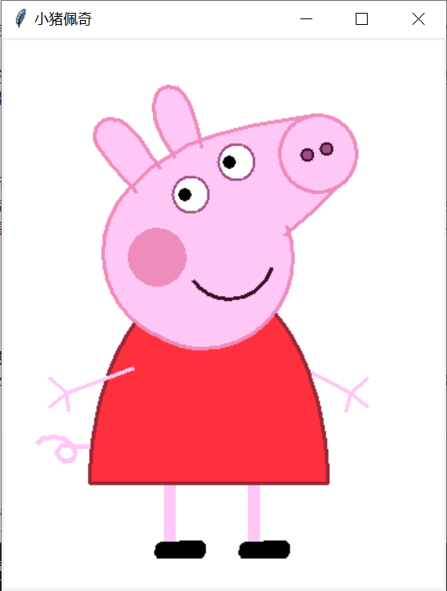
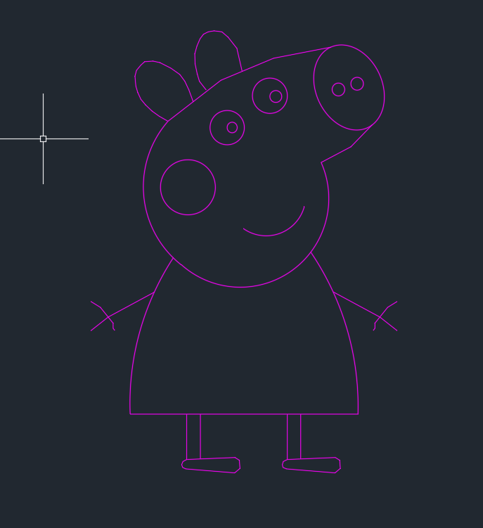
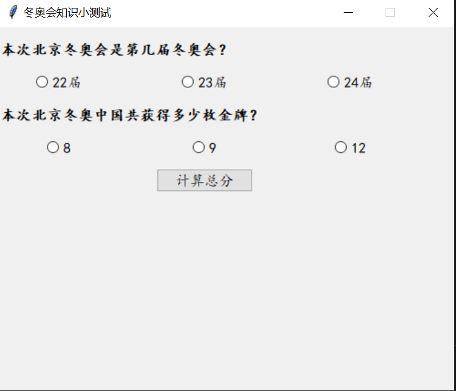
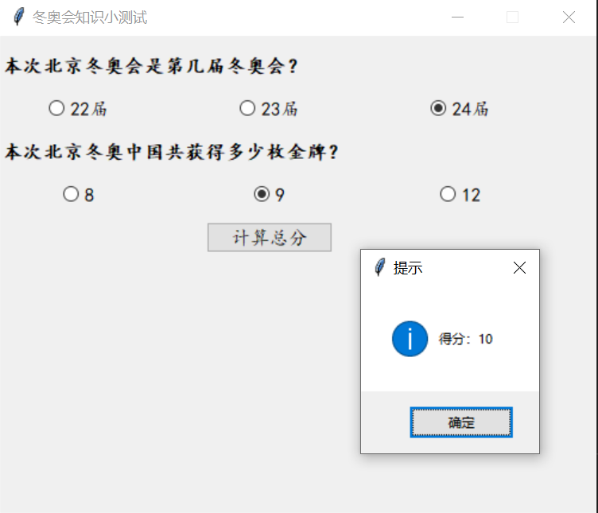

# Python程序设计平时作业7实验报告

**刘滨瑞 2021012579 未央-水木12**

## Problem1：画图

### 运行结果

源文件为Paintpackage目录下的_paint.py，运行结果截图如下：



如图所示，程序顺利地完成了对小猪佩奇的绘制工作，还原程度较高。

### 实现思路

- 由于Canvas中的绘图函数不支持倾斜椭圆的绘画，因此全图主要采用**多边形逼近**的方式绘图，通过绘制有着足够多顶点数的多边形，来近似地绘制所需要的曲线。如佩奇的耳朵，尾巴、鞋和头的轮廓线均是通过多边形绘制而成。

- 使用tkinter绘图需要知道准确的坐标数据，因此笔者在绘图前先在**AutoCAD**中绘制了小猪佩奇的轮廓线，如下图所示。此后即可十分方便地读取**顶点坐标**。



- 为最大程度地还原颜色，笔者在**Photoshop**中提取了原图片的**RGB数据**，并依此在程序的最开始定义了颜色表。代码如下：

```python
#颜色表
white = '#FFFFFF'
black = '#010101'
pink0 = '#FFC7F6'
pink1 = '#EE8CBB'
pink2 = '#9F4E83'
pink3 = '#3B0F26'
red = '#FE303D'
crimson = '#982737'
```

## Problem2：tkinter控件的使用

### 运行结果

源文件为Widgetspackage目录下的_widgets.py，运行结果截图如下：



如图所示，顺利创建了一个冬奥会知识小测试的图形窗口。

点击“计算总分”按钮即可提交答案，将弹出一个提示框返回作答的分数，每题5分。
初始状态下两道题均为未选中答案的状态，空答案同样视为错误答案。
测试截图如下：



### 实现思路

- 使用gird进行布局管理，共分为5行3列。

- 为保证用户的视觉效果，使用**resizable方法**限制了用户对界面大小的调整，并通过调取当前屏幕分辨率，保证界面总是出现在**屏幕正中央**。相关代码如下：

```python
root.resizable(False, False)#不可调整界面大小
#框架大小固定为height=400,width=500,自动调取屏幕分辨率以使界面总是出现在屏幕正中央
width = 500
height = 400
pos = width, height, (root.winfo_screenwidth() - width) / 2, (root.winfo_screenheight() - height) / 2
root.geometry('%dx%d+%d+%d' % pos)
```
