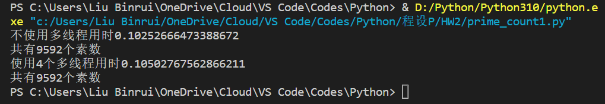
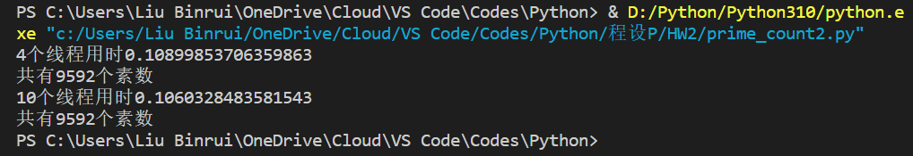
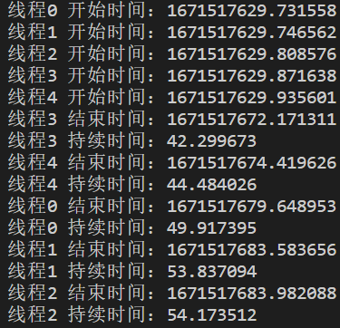

# Python程序设计平时作业8实验报告

**刘滨瑞 2021012579 未央-水木12**

### 任务：统计1~100000之间的素数个数

## Ⅰ 使用多线程和单线程两种方法

### 运行结果

源文件为src/_primecount目录下的prime_count1.py文件，运行结果截图如下：



如上图所示，程序分别使用了多线程和单线程方法顺利地完成了素数统计工作。

结果显示：1~100000之间共有**9592**个素数。

统计运行时间：使用单线程方法用时**0.10253s**，使用多线程方法用时**0.10503s**。
由于系统调度和资源分配的原因，多次运行程序得到的结果并不完全一致，因此上述结果的有效位数只有两位。可以认为使用多线程和单线程两种方法的运行时间是相同的，即**多线程方法并没有能够提高计算效率**。

## Ⅱ 使用4个多线程和10个多线程两种方法

### 运行结果

源文件为src/_primecount目录下的prime_count2.py文件，运行结果截图如下：



如图所示，程序分别启用了4个线程和10个线程顺利地方法完成了素数统计工作。

结果显示：1~100000之间共有**9592**个素数。

统计运行时间，使用4个多线程方法用时**0.10900s**，使用多线程方法用时**0.10603s**。
由于系统调度和资源分配的原因，多次运行程序得到的结果并不完全一致，因此上述结果的有效位数只有两位。可以认为使用4个多线程和10个多线程两种方法的运行时间是相同的，即**增加线程数也不能提高计算效率**。

## 关于多线程计算效率不高的问题分析

查阅相关资料后得知，在常见的Python解释器中存在着**全局解释器锁**（Global Interpreter Lock，简称**GIL**）。这意味着在一个线程正在运行时，其他线程只能处于等待状态。也就是说，python中的线程实际上是自带一个互斥锁的，在任何时候都只能有一个线程处于运行状态。Python实际上是靠线程调度**在形式上**实现了多线程功能，

以下的代码可以进一步说明Python解释器中GIL的效果。

```python
import time
import threading
def test(order:int):
    start = time.time()
    print('线程%d 开始时间：%f' % (order, start))
    re0 = 1
    for i in range(2, 200001):
        re0 = re0 * i
    end = time.time()
    print('线程%d 结束时间：%f' % (order, end))
    print('线程%d 持续时间：%f' % (order, end - start))
ths = []
for i in range(5):
    ths.append(threading.Thread(target = test, args = (i,)))
for i in range(5):
    ths[i].start()
```

运行结果为：


五个线程若是并行运算，则它们的运行时间应该相近，而不会出现如上图中线程2和线程3足足10s的差距。

综上，Python的多线程实际上是“**伪并行**”。本质上讲Python中始终只有一个线程，多线程方法只是实现了解释器资源的合理分配罢了，因此**在Python中多线程方法并不能提高运行效率**。
